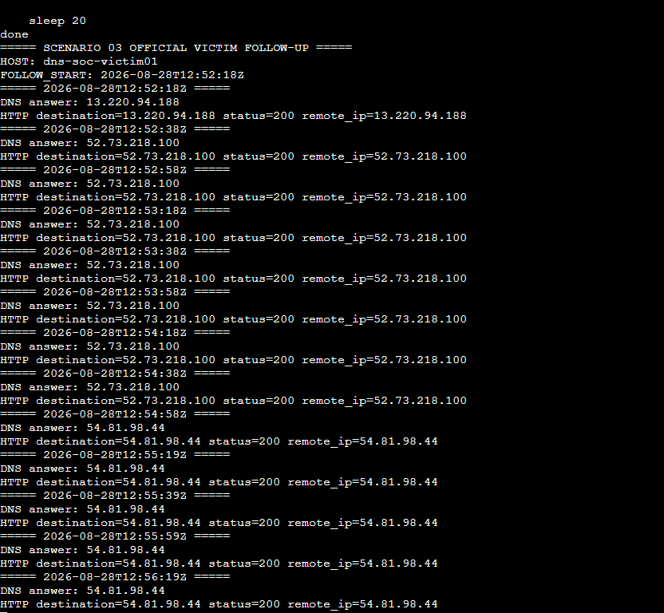
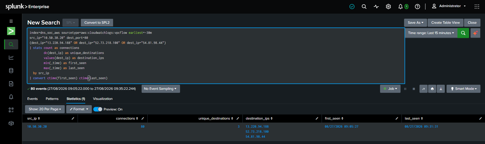
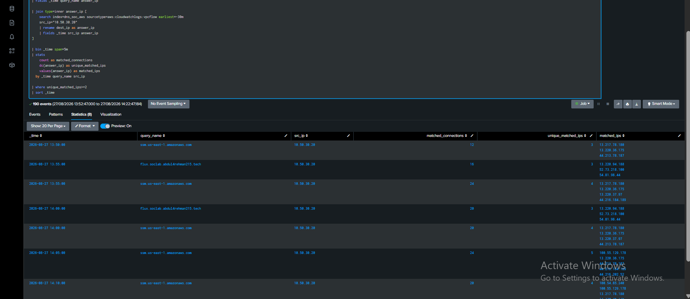
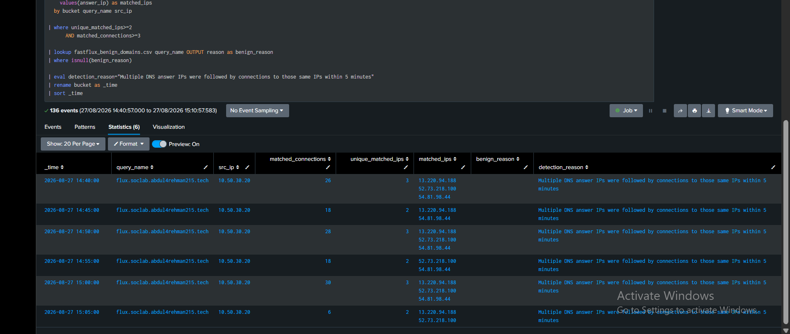
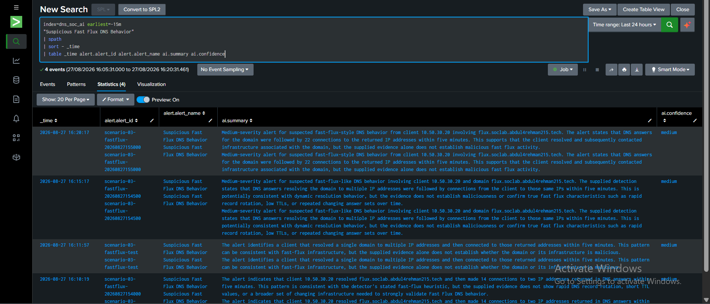
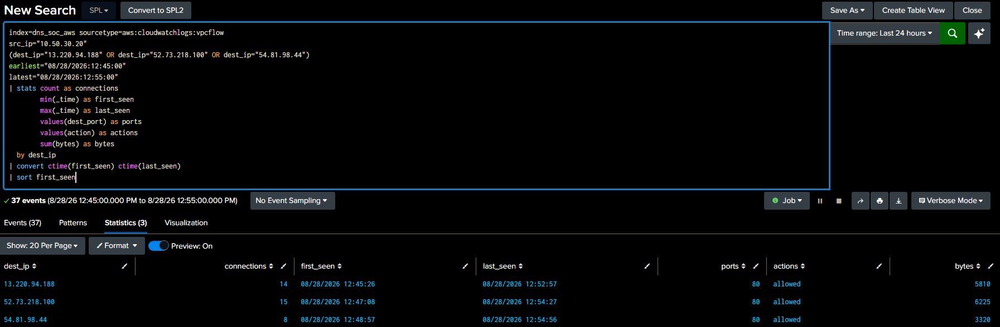
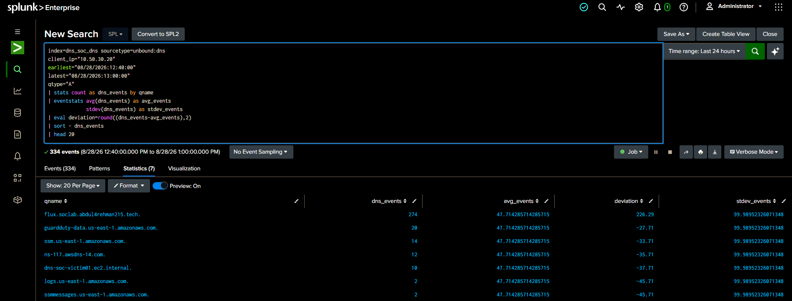

<a id="top"></a>


<div align="center">


<br/>


<br/>

[🎬 Execution](SCENARIO-03-EXECUTION.md) · [🎯 Operator](attacker/README.md) · [🧠 Detection Engineering](detection-engineering/README.md) · [📊 Dashboard](dashboard/README.md) · [🤖 AI](ai/README.md) · [🔎 SOC](soc/README.md) · [🛡️ IR](ir/README.md) · [🧾 Evidence](evidence/README.md)

[🏗️ Infrastructure](https://github.com/DNSentinel-Lab/DNS-Lab-Infrastructure) · [🔎 Scenario 01](https://github.com/DNSentinel-Lab/Scenario-01-DNS-Recon) · [🧬 Scenario 02](https://github.com/DNSentinel-Lab/Scenario-02-DGA) · [**🔄 Scenario 03**](https://github.com/DNSentinel-Lab/Scenario-03-Fast-Flux) · [🛰️ Scenario 04](https://github.com/DNSentinel-Lab/Scenario-04-DNS-Tunneling)

</div>


Scenario 03 asks a deceptively simple question:

> **When one hostname keeps moving between public IP addresses, how do we prove suspicious Fast Flux-like behavior without confusing it with legitimate cloud/CDN dynamics?**

The team built the answer in layers. Musfira engineered a rule that matched DNS-returned public addresses to the destinations actually contacted by the victim. Lubaba then ran the approved Fast Flux controller without using Splunk feedback to steer the outcome. Abdul-Rehman rebuilt the case from defender telemetry and escalated only what the evidence justified. Sonia independently strengthened DNS answer history, investigated endpoint context, and decided that containment was **not** proportionate because the activity was controlled and already inactive.

This repository now records the complete case rather than only the engineering preparation.

## 🏁 Scenario 03 Closeout Snapshot

<table>
<tr>
<td align="center" width="16%"><strong>🔄 Flux</strong><br/><sub>1 hostname → 3 public IPs</sub></td>
<td align="center" width="17%"><strong>🧠 Detection</strong><br/><sub>v1.0 fired</sub></td>
<td align="center" width="17%"><strong>🤖 AI</strong><br/><sub>Partially Correct</sub></td>
<td align="center" width="17%"><strong>🔎 SOC</strong><br/><sub>Inconclusive → IR</sub></td>
<td align="center" width="17%"><strong>🛡️ IR</strong><br/><sub>Controlled / Expected</sub></td>
<td align="center" width="16%"><strong>⚖️ Response</strong><br/><sub>No containment</sub></td>
</tr>
</table>

<div align="center">

**274 A-query events · 1 client · 3 alert IPs · 37 manually validated flows**

**Rotate → Resolve → Connect → Correlate → Detect → Investigate → Decide → Verify**

</div>

> **Scenario 03's strongest result was not a block. It was a defensible decision not to change the network after stronger evidence showed the activity was controlled, inactive, and already in a safe state.**


## 🚦 Final Status

| Workstream | Final result | Owner |
|---|---|---|
| Fast Flux infrastructure + Detection Engineering | ✅ Complete / Detection v1.0 frozen | [Musfira](https://github.com/MUSFIRA-ZAFAR) |
| Official operator execution | ✅ Complete | [Lubaba](https://github.com/lubaba1513-pixel) |
| SOC investigation + IR handoff | ✅ Complete — `INCONCLUSIVE → IR` | [Abdul-Rehman](https://github.com/abdul4rehman215) |
| IR validation + response decision + safe-state verification | ✅ Complete — `CONTROLLED / EXPECTED` | [Sonia](https://github.com/sonia11mansha415) |
| AI assistance | ✅ Working — **Partially Correct**, advisory only | Detection + SOC |
| Ground-truth reveal + closeout | ✅ Complete | Team |

> [!IMPORTANT]
> In Scenario 03 sinkhole action was not implemented. IR concluded that the behavior was controlled, inactive, and did not justify an enforcing resolver-policy change. The absence of containment is itself an evidence-backed response decision.

## 👥 Four Roles · One Connected Case

| Role | Owner | What the role proved |
|---|---|---|
| 🎯 Project Lead / Operator | [Lubaba](https://github.com/lubaba1513-pixel) | preserved controller integrity, executed approved rotation, generated real victim follow-up, kept ground truth separated, stopped cleanly |
| 🧠 Detection Engineer | [Musfira](https://github.com/MUSFIRA-ZAFAR) | converted Resolver answers + VPC Flow into a tuned behavior-based detection and operational alert |
| 🔎 SOC Analyst / Threat Hunter | [Abdul-Rehman](https://github.com/abdul4rehman215) | validated the alert from defender evidence, scoped the activity, challenged AI, completed 5W1H, escalated with attribution limits |
| 🛡️ IR / Defender | [Sonia](https://github.com/sonia11mansha415) | independently rebuilt answer history, investigated host context, ruled on containment, verified resolver/RPZ safe state |

## 🏗️ What Actually Happened

```mermaid
%%{init: {
  "theme": "base",
  "themeVariables": {
    "background": "#030712",
    "primaryTextColor": "#ffffff",
    "lineColor": "#f8fafc",
    "fontSize": "30px"
  },
  "flowchart": {
    "nodeSpacing": 48,
    "rankSpacing": 58,
    "curve": "basis",
    "padding": 20
  }
}}%%

flowchart LR

    %% =====================================================
    %% 1 · SCENARIO ACTORS + DNS
    %% =====================================================
    subgraph SOURCE[" "]
        direction TB

        H1["🎯 1 · SCENARIO + DNS"]

        O["🎯 Lubaba<br/>dns-attack01<br/>Approved Route 53 Rotation"]

        V["🖥️ dns-soc-victim01<br/>10.50.30.20"]

        R["🛡️ dns-soc-resolver01<br/>10.50.30.10"]

        HTTP["🌐 HTTP / 80<br/>Follow Returned DNS Answer"]

        H1 --> O
        H1 --> V

        V ==> R
        V ==> HTTP
    end


    %% =====================================================
    %% 2 · FAST FLUX ROTATION
    %% =====================================================
    subgraph FLUX[" "]
        direction TB

        H2["🔄 2 · FAST FLUX ROTATION"]

        F["🌍 flux.soclab.abdul4rehman215.tech<br/>⏱ TTL 60"]

        ROT["⚡ ROTATING ANSWERS<br/>Three Controlled Endpoints"]

        N1["🟢 dns-flux-node01<br/>13.220.94.188"]

        N2["🟠 dns-flux-node02<br/>52.73.218.100"]

        N3["🟣 dns-flux-node03<br/>54.81.98.44"]

        H2 ==> F ==> ROT

        ROT --> N1
        ROT --> N2
        ROT --> N3
    end


    %% =====================================================
    %% 3 · EVIDENCE + DETECTION
    %% =====================================================
    subgraph DETECTION[" "]
        direction TB

        H3["📡 3 · EVIDENCE + DETECTION"]

        D["📡 DNS / RESOLVER<br/>Evidence"]

        W["🌐 VPC FLOW<br/>Evidence"]

        S["🟢 SPLUNK ENTERPRISE<br/>Correlation + Analysis"]

        DET["🧠 DETECTION v1.0<br/>Fast Flux Analytics"]

        H3 --> D
        H3 --> W

        D ==> S
        W ==> S

        S ==> DET
    end


    %% =====================================================
    %% 4 · HUMAN ANALYSIS + DECISION
    %% =====================================================
    subgraph HUMAN[" "]
        direction TB

        H4["🛡️ 4 · ANALYSIS + DECISION"]

        AI["🤖 AI ASSISTANCE<br/>Evidence Context"]

        SOC["🔎 Abdul-Rehman<br/>SOC Investigation"]

        IR["🛡️ Sonia<br/>IR Validation"]

        DEC["✅ CONTROLLED / EXPECTED<br/>No Containment Required"]

        H4 --> AI
        H4 --> SOC

        AI ==> SOC
        SOC ==> IR ==> DEC
    end


    %% =====================================================
    %% CLEAN CROSS-STAGE FLOW
    %% =====================================================

    %% Operator changes authoritative answers
    O ==> F

    %% Victim resolves through defender DNS
    R ==> F

    %% HTTP follows whichever answer DNS returns
    HTTP -.-> ROT

    %% Telemetry enters evidence pipeline
    R ==> D
    HTTP ==> W

    %% Detection enters human workflow
    DET ==> AI
    DET ==> SOC


    %% =====================================================
    %% PREMIUM NEON HEADERS
    %% =====================================================
    classDef sourceHeader fill:#082f49,stroke:#67e8f9,stroke-width:7px,color:#ffffff,font-size:34px,font-weight:bold;

    classDef fluxHeader fill:#713f12,stroke:#fbbf24,stroke-width:7px,color:#ffffff,font-size:34px,font-weight:bold;

    classDef detectHeader fill:#312e81,stroke:#a78bfa,stroke-width:7px,color:#ffffff,font-size:34px,font-weight:bold;

    classDef humanHeader fill:#14532d,stroke:#86efac,stroke-width:7px,color:#ffffff,font-size:34px,font-weight:bold;

    class H1 sourceHeader;
    class H2 fluxHeader;
    class H3 detectHeader;
    class H4 humanHeader;


    %% =====================================================
    %% SCENARIO + DNS COLORS
    %% =====================================================
    classDef operator fill:#7f1d1d,stroke:#fb7185,stroke-width:6px,color:#ffffff,font-size:29px,font-weight:bold;

    classDef victim fill:#172554,stroke:#60a5fa,stroke-width:6px,color:#ffffff,font-size:29px,font-weight:bold;

    classDef resolver fill:#075985,stroke:#22d3ee,stroke-width:6px,color:#ffffff,font-size:29px,font-weight:bold;

    classDef http fill:#0f766e,stroke:#5eead4,stroke-width:6px,color:#ffffff,font-size:29px,font-weight:bold;

    class O operator;
    class V victim;
    class R resolver;
    class HTTP http;


    %% =====================================================
    %% FAST FLUX COLORS
    %% =====================================================
    classDef domain fill:#581c87,stroke:#f0abfc,stroke-width:7px,color:#ffffff,font-size:30px,font-weight:bold;

    classDef rotation fill:#9a3412,stroke:#fb923c,stroke-width:6px,color:#ffffff,font-size:29px,font-weight:bold;

    classDef node1 fill:#14532d,stroke:#4ade80,stroke-width:6px,color:#ffffff,font-size:28px,font-weight:bold;

    classDef node2 fill:#9a3412,stroke:#fdba74,stroke-width:6px,color:#ffffff,font-size:28px,font-weight:bold;

    classDef node3 fill:#4c1d95,stroke:#c084fc,stroke-width:6px,color:#ffffff,font-size:28px,font-weight:bold;

    class F domain;
    class ROT rotation;
    class N1 node1;
    class N2 node2;
    class N3 node3;


    %% =====================================================
    %% EVIDENCE + DETECTION COLORS
    %% =====================================================
    classDef dnsEvidence fill:#083344,stroke:#22d3ee,stroke-width:6px,color:#ffffff,font-size:29px,font-weight:bold;

    classDef flowEvidence fill:#172554,stroke:#60a5fa,stroke-width:6px,color:#ffffff,font-size:29px,font-weight:bold;

    classDef splunk fill:#14532d,stroke:#4ade80,stroke-width:7px,color:#ffffff,font-size:30px,font-weight:bold;

    classDef detection fill:#4c1d95,stroke:#e879f9,stroke-width:7px,color:#ffffff,font-size:30px,font-weight:bold;

    class D dnsEvidence;
    class W flowEvidence;
    class S splunk;
    class DET detection;


    %% =====================================================
    %% HUMAN WORKFLOW COLORS
    %% =====================================================
    classDef ai fill:#581c87,stroke:#f0abfc,stroke-width:6px,color:#ffffff,font-size:29px,font-weight:bold;

    classDef soc fill:#075985,stroke:#38bdf8,stroke-width:6px,color:#ffffff,font-size:29px,font-weight:bold;

    classDef ir fill:#312e81,stroke:#a78bfa,stroke-width:6px,color:#ffffff,font-size:29px,font-weight:bold;

    classDef final fill:#166534,stroke:#86efac,stroke-width:7px,color:#ffffff,font-size:30px,font-weight:bold;

    class AI ai;
    class SOC soc;
    class IR ir;
    class DEC final;


    %% =====================================================
    %% GLOSSY PANELS
    %% =====================================================
    style SOURCE fill:#06131d,stroke:#22d3ee,stroke-width:4px

    style FLUX fill:#180d05,stroke:#fbbf24,stroke-width:4px

    style DETECTION fill:#0d1022,stroke:#a78bfa,stroke-width:4px

    style HUMAN fill:#07140d,stroke:#4ade80,stroke-width:4px


    %% =====================================================
    %% BRIGHT CONNECTORS
    %% =====================================================
    linkStyle default stroke:#f8fafc,stroke-width:5px;
```



### Exercise-time endpoint pool

| Node | Private IP | Exercise-time public IP |
|---|---:|---:|
| `dns-flux-node01` | `10.60.10.21` | `13.220.94.188` |
| `dns-flux-node02` | `10.60.10.22` | `52.73.218.100` |
| `dns-flux-node03` | `10.60.10.23` | `54.81.98.44` |

These public IPs are **historical run evidence**. The three temporary flux EC2 nodes were deleted after the exercise.

## 🎬 Official Operator Result

[Lubaba's](https://github.com/lubaba1513-pixel) approved controller ran unchanged from `dns-attack01` and completed a full three-node cycle. The victim then resolved the stable hostname through `10.50.30.10` and followed the returned address over HTTP.

```text
Official Fast Flux start: 2026-08-28T12:43:43Z
Victim follow-up start:   2026-08-28T12:52:18Z
Victim follow-up end:     2026-08-28T12:58:04Z
Official Fast Flux end:   2026-08-28T12:58:30Z
```
<!--


*The operator captured controller identity, exact start time and the first Route 53 transition while keeping the live SOC side isolated from operator ground truth.*



*The victim resolved the changing hostname and successfully followed the returned destination; HTTP `200` and `remote_ip` matched the DNS answer.*
-->

[Read Lubaba's complete operator story →](attacker/PROJECT-LEAD-ADVERSARY.md)

## 🧠 Detection Engineering Result

Detection v1.0 was frozen before the official run.

**Name:** `Suspicious Fast Flux DNS Behavior`  
**MITRE:** `T1568.001 — Dynamic Resolution: Fast Flux DNS`  
**Severity:** Medium  
**Behavioral window:** 5 minutes

The production rule requires:

```text
A + NOERROR Resolver answer
+
public DNS answer
+
victim contacted that same returned IP
+
unique_matched_ips >= 2
+
matched_connections >= 3
+
RFC1918 excluded
+
known benign dynamic domains excluded by lookup
```

The important tuning lesson was that ordinary AWS/Ubuntu/Splunk services also produced answer churn. The rule therefore detects **correlated behavior**.

[Read Musfira's Detection Engineering story →](detection-engineering/DETECTION-ENGINEERING.md)

## 🔎 SOC Investigation — Evidence Before Verdict

The live alert surfaced the scenario domain with three public IPs. [Abdul Rehman](https://github.com/abdul4rehman215) then rebuilt the case rather than accepting the alert as a verdict.

### Key SOC findings

| Evidence | SOC result |
|---|---|
| Scenario-domain A-query volume | **274** events in the reviewed 20-minute window |
| Internal client scope | **1** client — `10.50.30.20` |
| Alert-associated public IPs | **3** |
| Manual VPC Flow validation | **37** flows in the narrow 12:45–12:55 window |
| Per-IP manual flow counts | `14 / 15 / 8` |
| Later detection-side matched connections | **42** for the same 12:50 alert bucket |
| Benign lookup | Scenario domain **not present** |
| Next-highest A-query domain | **20** events |
| AI validation | **Partially Correct** |

The 37-versus-42 difference was preserved, the manual investigation and production rule used different aggregation/window logic.

[Abdul-Rehman](https://github.com/abdul4rehman215) locked:

> **SOC Disposition: INCONCLUSIVE — ESCALATION WARRANTED**  
> **Fast Flux-like behavior confidence: Medium-High**  
> **Malicious attribution confidence: Low**

[Read the full SOC investigation →](soc/SOC-ANALYST-INVESTIGATION.md)

## 🤖 AI Assistance — Useful, but Not the Verdict

The AI correctly preserved uncertainty, mapped `T1568.001`, required human validation, and avoided declaring malware or confirmed malicious C2. It was still graded **Partially Correct** because parts of its DNS-to-IP reasoning inherited the detection correlation before the SOC had independently rebuilt all supporting evidence.

The final sequence remained:

```text
raw evidence
→ analyst hypothesis
→ AI review
→ AI validation
→ human disposition
```

[Read the AI validation record →](soc/AI-VALIDATION.md)

## 🛡️ IR — Stronger Evidence, Different Decision

[Sonia](https://github.com/sonia11mansha415) did not simply repeat the SOC handoff. She independently found the AWS Resolver Query Log source, extracted the three A answers, used AWS `query_timestamp` for answer chronology, validated victim-to-destination flows, checked current activity, and then investigated the victim host when Splunk lacked endpoint/process telemetry.

### IR strengthened the case with

- independent Resolver history for all three A answers;
- source-native answer transition timestamps;
- a documented historical TTL evidence gap;
- VPC Flow correlation across the wider IR window;
- single-client scope;
- current DNS/network inactivity;
- local Linux shell history showing Scenario 03 `dig` / `curl` follow-up logic;
- CloudTrail + SSM session context;
- cron and active-process checks;
- RPZ safe-state and Unbound health verification;
- normal DNS verification from the victim.

[Sonia's](https://github.com/sonia11mansha415) final decision:

> ## **CONTROLLED / EXPECTED SCENARIO ACTIVITY — NO CONTAINMENT REQUIRED**

No Scenario 03 RPZ rule, resolver-policy change, host isolation, sinkhole enforcement, reload or restart was applied.

That was not an incomplete response. It was the proportionate response.

[Read Sonia's complete IR record →](ir/INCIDENT-RESPONSE.md)

## 🛡️ Safe-State Verification

Even without an enforcing change, IR verified that the environment was left safe:

- active RPZ contained no Scenario 03 flux rule;
- `unbound-checkconf` returned no errors;
- Unbound remained active;
- unrelated DNS resolved normally;
- the Scenario 03 hostname resolved to a public A record during final defender validation;
- no matching `dig` / `curl` process remained active.

<!--


*The final victim-side check proved normal resolver operation and observed a live TTL of 60. IR did not retroactively claim that every historical answer had TTL 60 because historical Resolver events did not expose TTL.*
-->

## 📸 Scenario 03 Evidence Highlights

> **Build → Rotate → Correlate → Detect → Investigate → Decide → Verify**

The strongest evidence is curated here as a **visual proof layer**. The full role-owned evidence sets remain in their original folders.

### 🏗️ Fast Flux Infrastructure Evidence

<table>
<tr>
<td width="33%" valign="top"><br/><br/><strong>Flux record:</strong> the controlled hostname was configured with the exercise-time Route 53 A-record/TTL boundary.</td>
<td width="33%" valign="top"><br/><br/><strong>Authoritative validation:</strong> changing public DNS answers were confirmed before the official exercise.</td>
<td width="33%" valign="top"><br/><br/><strong>Network visibility:</strong> VPC Flow Logs captured victim communication with the rotating public destinations.</td>
</tr>
</table>

<div align="center">

**Explore:** [🏗️ Engineering Evidence](evidence/ENGINEERING-EVIDENCE-MANIFEST.md) · [🖼️ Screenshot Portal](screenshots/README.md)

</div>


### 🧠 Detection Engineering & AI Evidence

<table>
<tr>
<td width="33%" valign="top"><br/><br/><strong>Correlation breakthrough:</strong> DNS-returned public addresses were matched to destinations the victim actually contacted.</td>
<td width="33%" valign="top"><br/><br/><strong>Detection v1.0:</strong> the tuned rule required correlated DNS-answer and network behavior rather than simple DNS churn.</td>
<td width="33%" valign="top"><br/><br/><strong>AI assistance:</strong> the structured alert reached the shared triage path while decision authority remained human.</td>
</tr>
</table>

<div align="center">

**Explore:** [🧠 Detection Engineering](detection-engineering/README.md) · [📊 Dashboard](dashboard/README.md) · [🤖 AI](ai/README.md)

</div>


### 🎯 Official Operator Ground Truth

<table>
<tr>
<td width="33%" valign="top"><br/><br/><strong>Official execution:</strong> the approved controller started with defender-side ground truth still isolated.</td>
<td width="33%" valign="top"><br/><br/><strong>Full rotation:</strong> the controlled hostname completed a three-node answer cycle.</td>
<td width="33%" valign="top"><br/><br/><strong>Real follow-up:</strong> the victim resolved the changing hostname and contacted the returned destination successfully.</td>
</tr>
</table>

<div align="center">

**Explore:** [🎯 Operator Workspace](attacker/README.md) · [🧾 Operator Evidence](attacker/evidence/README.md) · [🎭 Exercise Control](exercise/README.md)

</div>


### 🔎 SOC Investigation Evidence

<table>
<tr>
<td width="33%" valign="top"><br/><br/><strong>Lead surfaced:</strong> Detection v1.0 created a live Fast Flux investigation lead; it did not create a malicious verdict.</td>
<td width="33%" valign="top"><br/><br/><strong>Independent network validation:</strong> the SOC confirmed victim traffic to all three alert destinations.</td>
<td width="33%" valign="top"><br/><br/><strong>Behavioral context:</strong> the scenario domain materially deviated from normal client A-query activity.</td>
</tr>
</table>

<div align="center">

**Explore:** [🔎 SOC Workspace](soc/README.md) · [🧾 SOC Evidence E01–E18](soc/evidence/README.md) · [📘 Full Investigation](soc/SOC-ANALYST-INVESTIGATION.md)

</div>

### 🛡️ IR Decision & Safe-State Evidence

<table>
<tr>
<td width="33%" valign="top"><br/><br/><strong>Independent DNS reconstruction:</strong> IR recovered all three historical A answers directly from defender Resolver Query Logs.</td>
<td width="33%" valign="top"><br/><br/><strong>Answer chronology:</strong> source-native timestamps established when the destination answers changed.</td>
<td width="33%" valign="top"><br/><br/><strong>Context strengthened:</strong> defender-side host evidence supported the controlled Scenario 03 follow-up explanation.</td>
</tr>
<tr>
<td width="50%" valign="top"><br/><br/><strong>No forced containment:</strong> the active RPZ remained free of Scenario 03 enforcement because containment was not justified.</td>
<td width="50%" valign="top"><br/><br/><strong>Safe state proven:</strong> normal resolver operation was verified from the victim after the response decision.</td>
</tr>
</table>

<div align="center">

**Explore:** [🛡️ IR Workspace](ir/README.md) · [🧾 IR Evidence](ir/evidence/README.md) · [📋 Final IR Report](ir/FINAL-IR-REPORT.md)

<br/>

<strong>Not changing the network can be the correct response when the evidence proves the activity is controlled, inactive, and already safe.</strong>

</div>


## 🎭 Final Reveal — One Event, Four Evidence Views

The final reveal showed that the roles were not contradicting one another; they had different evidence at different stages.

| Perspective | What it could know | Correct outcome |
|---|---|---|
| Lubaba / Operator | exact controller, timing and IP transitions | controlled Fast Flux execution completed |
| Detection v1.0 | DNS-answer + network-destination behavior | production alert generated |
| Abdul / SOC | defender DNS/network/baseline/AI evidence, no process context | **INCONCLUSIVE → IR** |
| Sonia / IR | stronger DNS history + host/context evidence | **Controlled / Expected → no containment** |

The SOC disposition remains professionally correct: process, user and authorization context were not yet available at the SOC stage. IR later gained additional defender-side evidence and responsibly refined the case.

[Read the final comparison →](exercise/final-comparison.md)

## 🧾 Evidence-First Lessons

- DNS churn alone is not enough; legitimate dynamic services do it too.
- A production alert is a structured lead, not an incident verdict.
- Different aggregation windows can produce different valid counts.
- AI can summarize evidence while still missing analyst-established context.
- Source-native cloud timestamps can matter more than Splunk `_time` for chronology.
- Missing endpoint telemetry should trigger an evidence pivot, not invented attribution.
- A containment mechanism should exist before the incident, but it should be used only when the evidence justifies it.
- “No containment” can be the strongest IR decision when current risk is low and the context is controlled.
- Cleanup is part of closeout: the controller and victim loop were stopped, and the three temporary flux EC2 nodes were retired after the exercise.

## 🗂️ Repository Navigation

| Workspace | Purpose |
|---|---|
| [`SCENARIO-03-EXECUTION.md`](SCENARIO-03-EXECUTION.md) | concise end-to-end scenario story |
| [`detection-engineering/`](detection-engineering/) | Musfira's telemetry, tuning, detection, alert, AI and dashboard engineering |
| [`attacker/`](attacker/) | Lubaba's operator execution, commands, evidence and ground truth |
| [`soc/`](soc/) | Abdul-Rehman's alert triage, investigation SPL, 5W1H, AI validation and IR handoff |
| [`ir/`](ir/) | Sonia's independent validation, host/context investigation, response decision and safe-state proof |
| [`exercise/`](exercise/) | information-separation protocol and final ground-truth comparison |
| [`evidence/`](evidence/) | cross-role Evidence Center |
| [`spl/`](spl/) | canonical Detection Engineering SPL and tuning lookup |
| [`dashboard/`](dashboard/) | final Scenario 03 Dashboard Studio JSON and panels |
| [`ai/`](ai/) | Scenario 03 AI evidence contract and validation artifacts |
| [`screenshots/`](screenshots/) | infrastructure / Detection Engineering / troubleshooting visual evidence |

## ✅ Completion Condition — Met

Scenario 03 is closed as an evidence-backed Fast Flux DNS case:

```text
controlled answer rotation
→ real victim follow-up
→ frozen behavioral detection
→ live alert
→ independent SOC investigation
→ evidence-limited escalation
→ stronger IR validation
→ proportionate no-containment decision
→ resolver/RPZ safe-state verification
→ operator ground-truth reveal
→ temporary endpoint cleanup
→ documentation closeout
```


<div align="center">

[🏠 Scenario Home](README.md) · [⬆ Back to top](#top)

**Evidence before attribution. Context before containment.**

</div>


