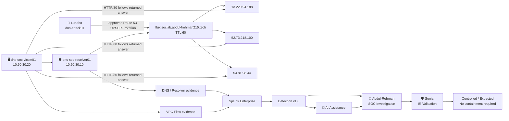

<a id="top"></a>


<div align="center">


**A completed, evidence-backed Fast Flux DNS exercise that moved from controlled answer rotation to behavioral detection, independent SOC investigation, defender-side attribution, response decision, safe-state verification, and final ground-truth comparison.**

[🎬 Execution](SCENARIO-03-EXECUTION.md) · [🎯 Operator](attacker/README.md) · [🧠 Detection Engineering](detection-engineering/README.md) · [🔎 SOC](soc/README.md) · [🛡️ IR](ir/README.md) · [🧾 Evidence](evidence/README.md)

[🏗️ Infrastructure](https://github.com/DNSentinel-Lab/DNS-Lab-Infrastructure) · [🔎 Scenario 01](https://github.com/DNSentinel-Lab/Scenario-01-DNS-Recon) · [🧬 Scenario 02](https://github.com/DNSentinel-Lab/Scenario-02-DGA) · [**🔄 Scenario 03**](https://github.com/DNSentinel-Lab/Scenario-03-Fast-Flux) · [🛰️ Scenario 04](https://github.com/DNSentinel-Lab/Scenario-04-DNS-Tunneling)

</div>


# 🔄 DNSentinel Scenario 03 — Fast Flux DNS

Scenario 03 asks a deceptively simple question:

> **When one hostname keeps moving between public IP addresses, how do we prove suspicious Fast Flux-like behavior without confusing it with legitimate cloud/CDN dynamics?**

The team built the answer in layers. Musfira engineered a rule that matched DNS-returned public addresses to the destinations actually contacted by the victim. Lubaba then ran the approved Fast Flux controller without using Splunk feedback to steer the outcome. Abdul-Rehman rebuilt the case from defender telemetry and escalated only what the evidence justified. Sonia independently strengthened DNS answer history, investigated endpoint context, and decided that containment was **not** proportionate because the activity was controlled and already inactive.

This repository now records the complete case rather than only the engineering preparation.

## 🚦 Final Status

| Workstream | Final result | Owner |
|---|---|---|
| Fast Flux infrastructure | ✅ Built, validated, then temporary flux nodes retired after the exercise | [Musfira](https://github.com/MUSFIRA-ZAFAR) |
| Detection Engineering | ✅ Complete / frozen Detection v1.0 | [Musfira](https://github.com/MUSFIRA-ZAFAR) |
| Official operator execution | ✅ Complete | [Lubaba](https://github.com/lubaba1513-pixel) |
| Independent SOC investigation | ✅ Complete — `INCONCLUSIVE — ESCALATION WARRANTED` | [Abdul-Rehman](https://github.com/abdul4rehman215) |
| AI assistance | ✅ Working — **Partially Correct**, advisory only | Detection + SOC |
| Incident Response | ✅ Complete — `CONTROLLED / EXPECTED SCENARIO ACTIVITY` | [Sonia](https://github.com/sonia11mansha415) |
| RPZ / sinkhole decision | ✅ Available but **not activated** because containment was not justified | [Sonia](https://github.com/sonia11mansha415) |
| Resolver / RPZ safe-state verification | ✅ Complete | [Sonia](https://github.com/sonia11mansha415) |
| Final ground-truth comparison | ✅ Complete | Team |

> [!IMPORTANT]
> Scenario 03 did **not** force a sinkhole action for portfolio appearance. IR concluded that the behavior was controlled, inactive, and did not justify an enforcing resolver-policy change. The absence of containment is itself an evidence-backed response decision.

## 👥 Four Roles · One Connected Case

| Role | Owner | What the role proved |
|---|---|---|
| 🎯 Project Lead / Operator | Lubaba | preserved controller integrity, executed approved rotation, generated real victim follow-up, kept ground truth separated, stopped cleanly |
| 🧠 Detection Engineer | Musfira | converted Resolver answers + VPC Flow into a tuned behavior-based detection and operational alert |
| 🔎 SOC Analyst / Threat Hunter | Abdul-Rehman | validated the alert from defender evidence, scoped the activity, challenged AI, completed 5W1H, escalated with attribution limits |
| 🛡️ IR / Defender | Sonia | independently rebuilt answer history, investigated host context, ruled on containment, verified resolver/RPZ safe state |

## 🏗️ What Actually Happened



### Exercise-time endpoint pool

| Node | Private IP | Exercise-time public IP |
|---|---:|---:|
| `dns-flux-node01` | `10.60.10.21` | `13.220.94.188` |
| `dns-flux-node02` | `10.60.10.22` | `52.73.218.100` |
| `dns-flux-node03` | `10.60.10.23` | `54.81.98.44` |

These public IPs are **historical run evidence**, not permanent architecture constants. The three temporary flux EC2 nodes were stopped/deleted/reset after the exercise. The exact teardown timestamp was not part of the preserved evidence package, so this repository does not invent one.

## 🎬 Official Operator Result

Lubaba's approved controller ran unchanged from `dns-attack01` and completed a full three-node cycle. The victim then resolved the stable hostname through `10.50.30.10` and followed the returned address over HTTP.

```text
Official Fast Flux start: 2026-08-28T12:43:43Z
Victim follow-up start:   2026-08-28T12:52:18Z
Victim follow-up end:     2026-08-28T12:58:04Z
Official Fast Flux end:   2026-08-28T12:58:30Z
```


*The operator captured controller identity, exact start time and the first Route 53 transition while keeping the live SOC side isolated from operator ground truth.*


*The victim resolved the changing hostname and successfully followed the returned destination; HTTP `200` and `remote_ip` matched the DNS answer.*

[Read Lubaba's complete operator story →](attacker/PROJECT-LEAD-ADVERSARY.md)

## 🧠 Detection Engineering Result

Detection v1.0 was frozen before the official run.

**Name:** `Suspicious Fast Flux DNS Behavior`  
**MITRE:** `T1568.001 — Dynamic Resolution: Fast Flux DNS`  
**Severity:** Medium  
**Behavioral window:** 5 minutes

The production rule requires:

```text
A + NOERROR Resolver answer
+
public DNS answer
+
victim contacted that same returned IP
+
unique_matched_ips >= 2
+
matched_connections >= 3
+
RFC1918 excluded
+
known benign dynamic domains excluded by lookup
```

The important tuning lesson was that ordinary AWS/Ubuntu/Splunk services also produced answer churn. The rule therefore detects **correlated behavior**, not simply “multiple A records.”


[Read Musfira's Detection Engineering story →](detection-engineering/DETECTION-ENGINEERING.md)

## 🔎 SOC Investigation — Evidence Before Verdict

The live alert surfaced the scenario domain with three public IPs. Abdul-Rehman then rebuilt the case rather than accepting the alert as a verdict.

### Key SOC findings

| Evidence | SOC result |
|---|---|
| Scenario-domain A-query volume | **274** events in the reviewed 20-minute window |
| Internal client scope | **1** client — `10.50.30.20` |
| Alert-associated public IPs | **3** |
| Manual VPC Flow validation | **37** flows in the narrow 12:45–12:55 window |
| Per-IP manual flow counts | `14 / 15 / 8` |
| Later detection-side matched connections | **42** for the same 12:50 alert bucket |
| Benign lookup | Scenario domain **not present** |
| Next-highest A-query domain | **20** events |
| AI validation | **Partially Correct** |

The 37-versus-42 difference was preserved rather than forced to match; the manual investigation and production rule used different aggregation/window logic.


*The live alert created an analyst lead. It did not create a malicious verdict.*


*Independent network evidence confirmed allowed TCP/80 connections from `10.50.30.20` to all three destinations named by the detection.*

Abdul-Rehman locked:

> **SOC Disposition: INCONCLUSIVE — ESCALATION WARRANTED**  
> **Fast Flux-like behavior confidence: Medium-High**  
> **Malicious attribution confidence: Low**

[Read the full SOC investigation →](soc/SOC-ANALYST-INVESTIGATION.md)

## 🤖 AI Assistance — Useful, but Not the Verdict

The AI correctly preserved uncertainty, mapped `T1568.001`, required human validation, and avoided declaring malware or confirmed malicious C2. It was still graded **Partially Correct** because parts of its DNS-to-IP reasoning inherited the detection correlation before the SOC had independently rebuilt all supporting evidence.

The final sequence remained:

```text
raw evidence
→ analyst hypothesis
→ AI review
→ AI validation
→ human disposition
```

[Read the AI validation record →](soc/AI-VALIDATION.md)

## 🛡️ IR — Stronger Evidence, Different Decision

Sonia did not simply repeat the SOC handoff. She independently found the AWS Resolver Query Log source, extracted the three A answers, used AWS `query_timestamp` for answer chronology, validated victim-to-destination flows, checked current activity, and then investigated the victim host when Splunk lacked endpoint/process telemetry.

### IR strengthened the case with

- independent Resolver history for all three A answers;
- source-native answer transition timestamps;
- a documented historical TTL evidence gap;
- VPC Flow correlation across the wider IR window;
- single-client scope;
- current DNS/network inactivity;
- local Linux shell history showing Scenario 03 `dig` / `curl` follow-up logic;
- CloudTrail + SSM session context;
- cron and active-process checks;
- RPZ safe-state and Unbound health verification;
- normal DNS verification from the victim.


*IR independently recovered all three A answers from defender-side Resolver Query Logs rather than inheriting the detection's DNS-to-IP claim.*


*Endpoint-side history strongly supported controlled Scenario 03 victim-follow-up activity while still leaving the earliest activity unattributed to a specific interactive session.*

Sonia's final decision:

> ## **CONTROLLED / EXPECTED SCENARIO ACTIVITY — NO CONTAINMENT REQUIRED**

No Scenario 03 RPZ rule, resolver-policy change, host isolation, sinkhole enforcement, reload or restart was applied.

That was not an incomplete response. It was the proportionate response.

[Read Sonia's complete IR record →](ir/INCIDENT-RESPONSE.md)

## 🛡️ Safe-State Verification

Even without an enforcing change, IR verified that the environment was left safe:

- active RPZ contained no Scenario 03 flux rule;
- `unbound-checkconf` returned no errors;
- Unbound remained active;
- unrelated DNS resolved normally;
- the Scenario 03 hostname resolved to a public A record during final defender validation;
- no matching `dig` / `curl` process remained active.


*The final victim-side check proved normal resolver operation and observed a live TTL of 60. IR did not retroactively claim that every historical answer had TTL 60 because historical Resolver events did not expose TTL.*

## 🎭 Final Reveal — One Event, Four Evidence Views

The final reveal showed that the roles were not contradicting one another; they had different evidence at different stages.

| Perspective | What it could know | Correct outcome |
|---|---|---|
| Lubaba / Operator | exact controller, timing and IP transitions | controlled Fast Flux execution completed |
| Detection v1.0 | DNS-answer + network-destination behavior | production alert generated |
| Abdul / SOC | defender DNS/network/baseline/AI evidence, no process context | **INCONCLUSIVE → IR** |
| Sonia / IR | stronger DNS history + host/context evidence | **Controlled / Expected → no containment** |

The SOC disposition remains professionally correct: process, user and authorization context were not yet available at the SOC stage. IR later gained additional defender-side evidence and responsibly refined the case.

[Read the final comparison →](exercise/final-comparison.md)

## 🧾 Evidence-First Lessons

- DNS churn alone is not enough; legitimate dynamic services do it too.
- A production alert is a structured lead, not an incident verdict.
- Different aggregation windows can produce different valid counts.
- AI can summarize evidence while still missing analyst-established context.
- Source-native cloud timestamps can matter more than Splunk `_time` for chronology.
- Missing endpoint telemetry should trigger an evidence pivot, not invented attribution.
- A containment mechanism should exist before the incident, but it should be used only when the evidence justifies it.
- “No containment” can be the strongest IR decision when current risk is low and the context is controlled.
- Cleanup is part of closeout: the controller and victim loop were stopped, and the three temporary flux EC2 nodes were retired after the exercise.

## 🗂️ Repository Navigation

| Workspace | Purpose |
|---|---|
| [`SCENARIO-03-EXECUTION.md`](SCENARIO-03-EXECUTION.md) | concise end-to-end scenario story |
| [`detection-engineering/`](detection-engineering/) | Musfira's telemetry, tuning, detection, alert, AI and dashboard engineering |
| [`attacker/`](attacker/) | Lubaba's operator execution, commands, evidence and ground truth |
| [`soc/`](soc/) | Abdul-Rehman's alert triage, investigation SPL, 5W1H, AI validation and IR handoff |
| [`ir/`](ir/) | Sonia's independent validation, host/context investigation, response decision and safe-state proof |
| [`exercise/`](exercise/) | information-separation protocol and final ground-truth comparison |
| [`evidence/`](evidence/) | cross-role Evidence Center and integrity manifest |
| [`spl/`](spl/) | canonical Detection Engineering SPL and tuning lookup |
| [`dashboard/`](dashboard/) | final Scenario 03 Dashboard Studio JSON and panels |
| [`ai/`](ai/) | Scenario 03 AI evidence contract and validation artifacts |
| [`screenshots/`](screenshots/) | infrastructure / Detection Engineering / troubleshooting visual evidence |

## ✅ Completion Condition — Met

Scenario 03 is closed as an evidence-backed Fast Flux DNS case:

```text
controlled answer rotation
→ real victim follow-up
→ frozen behavioral detection
→ live alert
→ independent SOC investigation
→ evidence-limited escalation
→ stronger IR validation
→ proportionate no-containment decision
→ resolver/RPZ safe-state verification
→ operator ground-truth reveal
→ temporary endpoint cleanup
→ documentation closeout
```

<div align="center">

### DNSentinel Lab
**Build the telemetry. Detect the behavior. Investigate the evidence. Respond only to what the evidence proves.**

[🎬 Execution](SCENARIO-03-EXECUTION.md) · [🧾 Evidence](evidence/README.md) · [⬆ Back to top](#top)

</div>


