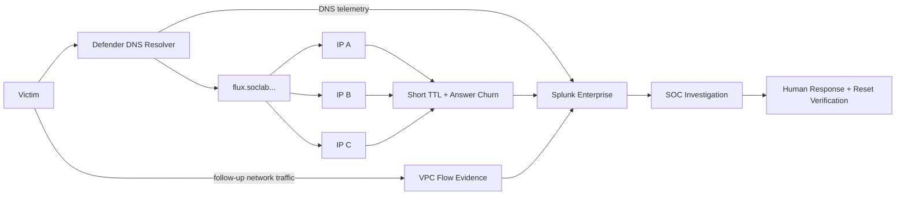

<a id="top"></a>


<div align="center">


<br/>


**A planned dynamic-resolution investigation that will correlate controlled DNS answer churn and short TTL behavior with real client/network evidence before any response decision.**

[🏗️ Infrastructure](https://github.com/DNSentinel-Lab/DNS-Lab-Infrastructure) · [🔎 Scenario 01](https://github.com/DNSentinel-Lab/Scenario-01-DNS-Recon) · [🧬 Scenario 02](https://github.com/DNSentinel-Lab/Scenario-02-DGA) · [**🔄 Scenario 03**](https://github.com/DNSentinel-Lab/Scenario-03-Fast-Flux) · [🛰️ Scenario 04](https://github.com/DNSentinel-Lab/Scenario-04-DNS-Tunneling)

</div>


## 🎯 Mission Brief

| Field | Scenario record |
|---|---|
| **Mission** | Produce controlled Fast Flux-like DNS answer changes and investigate DNS answer churn together with client network behavior |
| **Status** | ⚪ Planned — design ready; execution has not started |
| **MITRE ATT&CK** | `T1568.001 — Dynamic Resolution: Fast Flux DNS` |
| **Cyber Kill Chain** | Command & Control |
| **Core DNS evidence** | Multiple/changing answer IPs, short TTL behavior, answer-change timing |
| **Network evidence** | Victim follow-up destinations and VPC Flow correlation where generated |
| **Response** | Human-approved DNS block/sinkhole or controlled destination restriction, followed by reset/verification |

### What this scenario is designed to prove

Changing DNS answers are not automatically malicious. The project is designed to demonstrate how an analyst combines DNS answer churn, TTL behavior, destination changes and benign CDN-like tuning context before making a response decision.


## 🏗️ Scenario Architecture



> The design emphasizes DNS answer churn plus network destination evidence rather than treating one changing A record as proof of Fast Flux.


## 🔄 SOC Lifecycle & Implementation Reality

| Stage | State |
|---|---|
| **Design** | ✅ |
| **Infrastructure Reuse** | 🟡 |
| **Baseline** | ⚪ |
| **Simulate** | ⚪ |
| **Detect** | ⚪ |
| **SOC/IR** | ⚪ |
| **Verify** | ⚪ |
| **Document** | 🟡 |

> [!IMPORTANT]
> ✅ means supported by implemented project evidence. 🟡 means design/infrastructure/documentation exists but the scenario stage is not complete. ⚪ means planned and is **not presented as implemented**.


## 🎯 Objective

Use the controlled lab namespace to produce a domain whose answers change across multiple team-controlled IP addresses with short TTL behavior, then investigate the DNS and network evidence together.

## 🏗️ Infrastructure Dependency

Reuse the Scenario 02 resolver, victim and sinkhole. At preparation time, provision or identify a small set of team-controlled reachable endpoints/IPs and create temporary short-TTL `flux.soclab.abdul4rehman215.tech` DNS behavior. Remove/reset temporary resources after the exercise.

The shared AWS/Splunk platform is not rebuilt inside this repository. Any new AWS resource is designed in the infrastructure project and documented there after it exists.

## 🔎 Detection Focus

- one hostname returning multiple/changing answer IPs;
- short TTL behavior and answer churn across time windows;
- distinct destination count;
- correlation between DNS answers and victim connections;
- VPC Flow evidence for follow-up destinations;
- normal CDN-like or benign address changes considered during tuning;

## 🌐 Network & Protocol View

- Layer 7 DNS: answer IP set, TTL and answer-change timing;
- Layer 4: client connections to returned services/ports where generated;
- Layer 3: changing destination IPs and VPC Flow evidence;
- Endpoint/client: monitored victim identity;
- Containment: resolver block/sinkhole or controlled destination restriction when approved;

DNS is Layer 7 evidence, but the scenario should correlate it with the Layer 3/4, endpoint, cloud or application evidence that actually helps prove the behavior.

## 📊 Planned Dashboard

The dashboard should follow one shared time range and lead the analyst from summary → behavior → correlation → raw evidence.

- Shared time range plus client/domain/answer filters;
- KPIs: total queries, unique answer IPs, answer changes, TTL summary, unique destinations;
- Answer/IP churn over time;
- TTL distribution and current/previous answer sets;
- Victim follow-up destinations from VPC Flow Logs;
- Before/after containment or temporary-record reset evidence;

See [`dashboard/README.md`](dashboard/README.md) for the planned layout.

## 👥 Team

| Role | Member |
|---|---|
| Project Lead / Attack Simulation | Sonia |
| SOC Analyst | Lubaba |
| Detection Engineer | Abdul-Rehman |
| IR / Defender | Musfira |

## 🔄 Scenario Workflow

This repository follows the common 20-part standard:

**Objective → Architecture → Prerequisites → Simulation → Telemetry → Detection → SPL → Alert → AI Triage → SOC Analysis → IR → Evidence → Containment → Verification → Results → MITRE → False Positives → Lessons → Reproduction → Screenshots.**

The working checklist is [`SCENARIO-RUNBOOK.md`](SCENARIO-RUNBOOK.md).

## 🗂️ Repository Navigation

```text
.
├── README.md                 # scenario overview and locked design
├── SCENARIO-RUNBOOK.md       # 20-part execution/documentation checklist
├── dashboard/                # dashboard plan, later final XML/export
├── spl/                      # baseline, hunting, detection and validation SPL
├── ai/                       # scenario profile/payload mapping for shared AI bridge
├── ir/                       # response/containment/verification record
├── evidence/                 # structured ground truth and evidence notes
└── screenshots/              # curated visual evidence
```

The folders are prepared now, but fake implementation artifacts are not. Real `.spl`, dashboard XML, AI profiles and evidence are added only when they have been built and tested.

## 🔗 Shared Project References

- [DNS Lab Infrastructure](https://github.com/DNSentinel-Lab/DNS-Lab-Infrastructure) — shared AWS, DNS, Splunk and AI foundation
- [Scenario infrastructure roadmap](https://github.com/DNSentinel-Lab/DNS-Lab-Infrastructure/blob/main/00-project-design/scenario-infrastructure-roadmap.md) — future EC2/DNS/network changes owned by the infrastructure repository
- [Scenario documentation standard](https://github.com/DNSentinel-Lab/DNS-Lab-Infrastructure/blob/main/00-project-design/scenario-documentation-standard.md) — common 20-part SOC workflow, dashboard and evidence rules

## ✅ Completion Condition

The team proves changing controlled answers, correlates them with client network behavior, tunes against benign change patterns, validates AI/SOC analysis, and records cleanup/reset of temporary Fast Flux resources.


## 🧠 Security Engineering Skills in Scope

| Skill area | Scenario evidence / design focus |
|---|---|
| **DNS Analysis** | Answer set changes, TTL and answer-change timing |
| **Network Correlation** | Changing destination IPs and VPC Flow follow-up evidence |
| **Detection Engineering** | Baseline/tuning against benign CDN-like behavior |
| **SOC Investigation** | DNS + network evidence correlation |
| **Incident Response** | Approved block/sinkhole or restriction plus cleanup/reset verification |
| **AI-Assisted SOC** | Shared AI profile only after stable detection fields exist |


## 📚 Documentation Model

This scenario repository is a **case/execution layer** built on the shared [DNS Lab Infrastructure](https://github.com/DNSentinel-Lab/DNS-Lab-Infrastructure). It intentionally separates:

- **Design / prerequisites** — what must exist before the exercise;
- **Simulation / ground truth** — what the authorized operator actually generated;
- **Detection Engineering** — baseline, hunting, tuned detection and validation;
- **SOC investigation** — defender-visible evidence and human disposition;
- **IR / containment** — independently justified response and verification;
- **Evidence** — screenshots and structured artifacts that prove the final claims.

> [!NOTE]
> Planned work stays labelled as planned. This repository does not create fake screenshots, fake SPL results, fake ML metrics or fake incident outcomes to make a scenario look complete.

<div align="center">

### DNSentinel Lab
**Build the telemetry. Prove the detection. Investigate the evidence. Verify the response.**

[🏗️ Infrastructure](https://github.com/DNSentinel-Lab/DNS-Lab-Infrastructure) · [🔎 Scenario 01](https://github.com/DNSentinel-Lab/Scenario-01-DNS-Recon) · [🧬 Scenario 02](https://github.com/DNSentinel-Lab/Scenario-02-DGA) · [**🔄 Scenario 03**](https://github.com/DNSentinel-Lab/Scenario-03-Fast-Flux) · [🛰️ Scenario 04](https://github.com/DNSentinel-Lab/Scenario-04-DNS-Tunneling)

[⬆ Back to top](#top)

</div>


