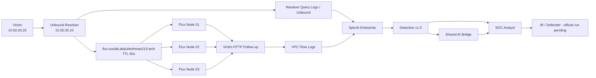
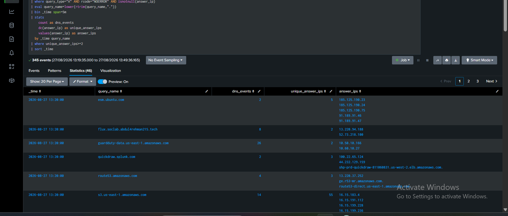

<a id="top"></a>


<div align="center">


**A controlled Fast Flux DNS case file with validated AWS infrastructure, real DNS answer churn, victim follow-up traffic, a tuned Splunk detection, scheduled alerting, AI-assisted context, and a two-tab investigation dashboard. The official attacker → SOC → IR execution is intentionally still pending.**

[🏗️ Infrastructure](https://github.com/DNSentinel-Lab/DNS-Lab-Infrastructure) · [🔎 Scenario 01](https://github.com/DNSentinel-Lab/Scenario-01-DNS-Recon) · [🧬 Scenario 02](https://github.com/DNSentinel-Lab/Scenario-02-DGA) · [**🔄 Scenario 03**](https://github.com/DNSentinel-Lab/Scenario-03-Fast-Flux) · [🛰️ Scenario 04](https://github.com/DNSentinel-Lab/Scenario-04-DNS-Tunneling)

</div>


# 🔄 DNSentinel Scenario 03 — Fast Flux DNS

Scenario 03 asks a harder question than “did one hostname return more than one IP?” Legitimate cloud and CDN services also move between addresses. The engineering goal was therefore to build a controlled moving destination, make the victim genuinely follow those DNS answers, and then detect **DNS-returned public IPs that were actually contacted by the same victim in the same short time window**.

> **Core question:** can we detect and investigate dynamic DNS infrastructure without confusing ordinary cloud/CDN behavior with malicious Fast Flux?

## 🚦 Current Status

| Workstream | Status | Owner |
|---|---|---|
| Fast Flux infrastructure extension | ✅ Complete / validated | [Musfira](https://github.com/MUSFIRA-ZAFAR) |
| Detection Engineering + tuning | ✅ Complete | [Musfira](https://github.com/MUSFIRA-ZAFAR) |
| Scheduled alert + Scenario 03 AI contract | ✅ Validated | [Musfira](https://github.com/MUSFIRA-ZAFAR) |
| Dashboard Studio | ✅ Complete | [Musfira](https://github.com/MUSFIRA-ZAFAR) |
| Official controlled simulation | ⏳ Pending | [Lubaba](https://github.com/lubaba1513-pixel) |
| Independent SOC investigation | ⏳ Pending | [Abdul-Rehman](https://github.com/abdul4rehman215) |
| IR / Defender response | ⏳ Pending | [Sonia](https://github.com/sonia11mansha415) |
| Containment verification + safe reset | ⏳ Pending | Sonia + team |
| Full scenario closeout | ⏳ Pending | Team |

> [!IMPORTANT]
> **Infrastructure complete + Detection Engineering complete does not mean the full scenario is complete.** The official information-separated attacker/SOC/IR exercise still has to be performed and documented.

## 👥 Scenario 03 Roles

| Role | Owner | Responsibility |
|---|---|---|
| Attack / Simulation Operator | Lubaba | execute the frozen controlled Fast Flux exercise and preserve private ground truth |
| SOC Analyst / Threat Hunter | Abdul-Rehman | investigate alerts independently and decide what the evidence proves |
| Detection Engineer | Musfira | infrastructure telemetry validation, baseline, hunts, final SPL, tuning, alert, AI contract and dashboard |
| Incident Responder / Defender | Sonia | independently validate the SOC handoff, apply an approved response, verify and reset |

## 🏗️ Implemented Architecture



### Controlled Fast Flux pool

| Node | Private IP | Exercise-time public IP* |
|---|---:|---:|
| `dns-flux-node01` | `10.60.10.21` | `13.220.94.188` |
| `dns-flux-node02` | `10.60.10.22` | `52.73.218.100` |
| `dns-flux-node03` | `10.60.10.23` | `54.81.98.44` |

\*Public addresses are **observed run values**, not permanent architecture constants. The rotation script refreshes current node public IPs before each cycle.

The shared infrastructure implementation is documented in the [DNS-Lab-Infrastructure repository](https://github.com/DNSentinel-Lab/DNS-Lab-Infrastructure).

## ✅ What the Infrastructure Validation Proved

The build was validated beyond “Route 53 changed a record.” The working chain became:

```text
rotation script
→ Route 53 UPSERT
→ authoritative A answer changes
→ resolver cache/TTL refresh
→ victim receives new answer
→ victim connects to that exact IP
→ HTTP 200
→ VPC Flow records the destination
→ Splunk receives the evidence
```


*The victim followed the DNS-returned destination and received HTTP 200 from the controlled Fast Flux nodes.*

## 🧠 Detection Engineering — Completed by Musfira

Musfira did not begin with a pre-written Fast Flux rule. The work started with real field validation and repeatedly tested whether the proposed behavior could separate the lab activity from normal AWS/cloud traffic.

```text
validate telemetry
→ baseline normal victim traffic
→ hunt public destination churn
→ discover Resolver answer data in aws:s3
→ extract answers{}.Rdata
→ match DNS answers to VPC destinations
→ test legitimate dynamic services
→ reject weak discriminators
→ tune through a benign lookup
→ freeze Detection v1.0
→ scheduled alert
→ AI contract
→ dashboard
```

### The important false-positive lesson

A simple DNS churn hunt also found legitimate dynamic infrastructure such as AWS SSM, GuardDuty, S3, Route 53, Ubuntu ESM and a Splunk service. That result prevented the project from using the weak rule:

```text
multiple A records = Fast Flux
```

Instead, the final rule requires **DNS answer-to-network destination matching**, short-window concentration and explicit benign tuning.



## 🎯 Detection v1.0

**Name:** `Suspicious Fast Flux DNS Behavior`  
**MITRE:** `T1568.001 — Dynamic Resolution: Fast Flux DNS`  
**Severity:** Medium  
**Behavioral window:** 5 minutes

The rule requires:

```text
A / NOERROR Resolver response
+
public DNS answer
+
victim contacted the same returned IP
+
unique_matched_ips >= 2
+
matched_connections >= 3
+
RFC1918 destinations excluded
+
known benign dynamic domains excluded by lookup
```

The canonical search is preserved in [`spl/detection.spl`](spl/detection.spl).


> The detection is behavior-based. It does not fire simply because the lab hostname contains the word `flux`.

## 🔔 Operational Alerting + AI Assistance

The frozen rule was operationalized as a scheduled Splunk alert:

```text
Schedule: */5 * * * *
Trigger: Number of Results > 0
Action: Triggered Alerts + Webhook
Webhook: internal dns-soc-ai-bridge route
```

The final result contract includes `alert_id`, `alert_name`, `scenario`, `severity`, `event_time`, `source` and `evidence_json`. The shared bridge then returns advisory context to `index=dns_soc_ai`.

AI remains a second opinion. The final AI result used **medium confidence** and did not claim that Fast Flux-like behavior alone proved malware.

## 📊 Final Dashboard

The final Dashboard Studio export is preserved at [`dashboard/scenario-03-fast-flux-detection.dashboard.json`](dashboard/scenario-03-fast-flux-detection.dashboard.json).

### Detection Overview


The overview combines detection activity, active answer count, 24-hour answer history and AI-assisted triage.

### Detection Context


The context tab keeps the detection name, Medium severity, MITRE `T1568.001`, five-minute window and benign lookup tuning visible to the analyst.

## 🛠️ Engineering Lessons That Changed the Rule

The strongest lessons were not cosmetic fixes. They changed the detection design:

- a stale search window can look like a broken detection;
- private HTTP destinations polluted the first multi-destination threshold, so RFC1918 ranges were excluded;
- time-only DNS/network correlation mixed unrelated domains;
- Resolver Query Logs were already present under generic `aws:s3` and exposed the real `answers{}.Rdata` field;
- DNS churn alone produced legitimate cloud false positives;
- “one answer per response” and “higher churn rate” were both tested and rejected as discriminators;
- the lookup itself needed data-quality validation;
- a working webhook route can still fail at the application schema boundary;
- the dashboard kept a historical fourth IP instead of forcing the display to match the expected three-node story.

See [`detection-engineering/TROUBLESHOOTING-AND-LESSONS.md`](detection-engineering/TROUBLESHOOTING-AND-LESSONS.md).

## 🗂️ Repository Navigation

| Area | Purpose |
|---|---|
| [`detection-engineering/`](detection-engineering/) | full engineering story, validation and lessons |
| [`spl/`](spl/) | baseline, hunts, final detection, validation, alert config and tuning lookup |
| [`dashboard/`](dashboard/) | final Dashboard Studio JSON and five panel searches |
| [`ai/`](ai/) | Scenario 03 payload/bridge mapping and validation artifacts |
| [`evidence/`](evidence/) | engineering evidence and simulation validation references |
| [`screenshots/`](screenshots/) | curated infrastructure, Detection Engineering and troubleshooting images |
| [`attacker/`](attacker/) | official Lubaba execution plan / private ground-truth template |
| [`soc/`](soc/) | Abdul-Rehman investigation template and questions |
| [`ir/`](ir/) | Sonia response playbook — official response still pending |
| [`exercise/`](exercise/) | official execution gates and closeout boundary |

## ⏭️ What Happens Next

The engineering environment should now be treated as frozen for the official exercise.

```text
Lubaba: controlled simulation + private ground truth
        ↓
Detection v1.0 / saved alert / AI / dashboard (unchanged)
        ↓
Abdul-Rehman: independent SOC investigation + disposition
        ↓
Sonia: independent IR validation + approved containment if warranted
        ↓
before/after verification + safe reset
        ↓
team ground-truth reveal + final closeout
```

No official SOC conclusion, containment result or final outcome is claimed in this repository yet.

<div align="center">

### DNSentinel Lab
**Build the telemetry. Prove the detection. Investigate the evidence. Verify the response.**

[⬆ Back to top](#top)

</div>
