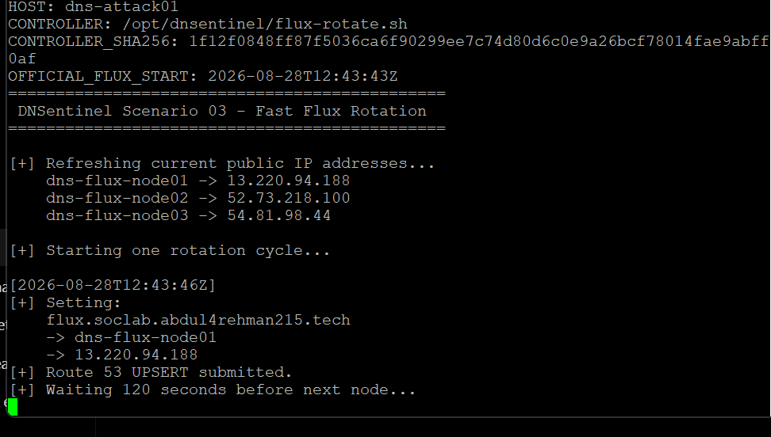
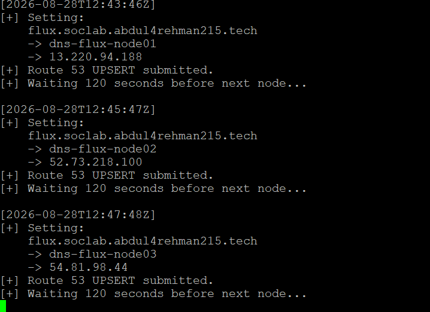
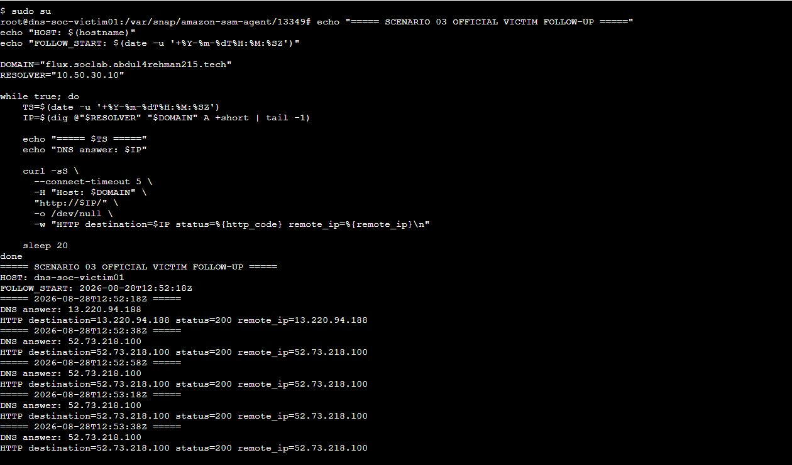
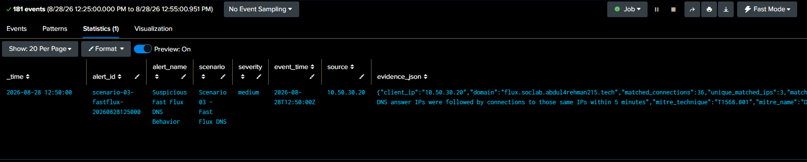
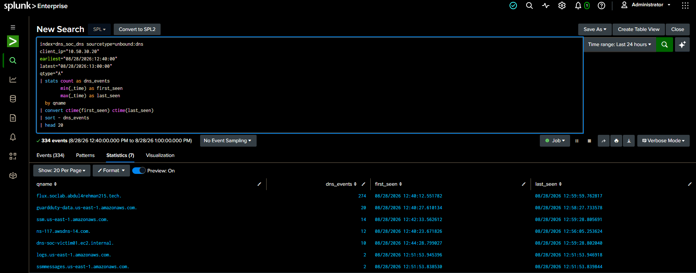
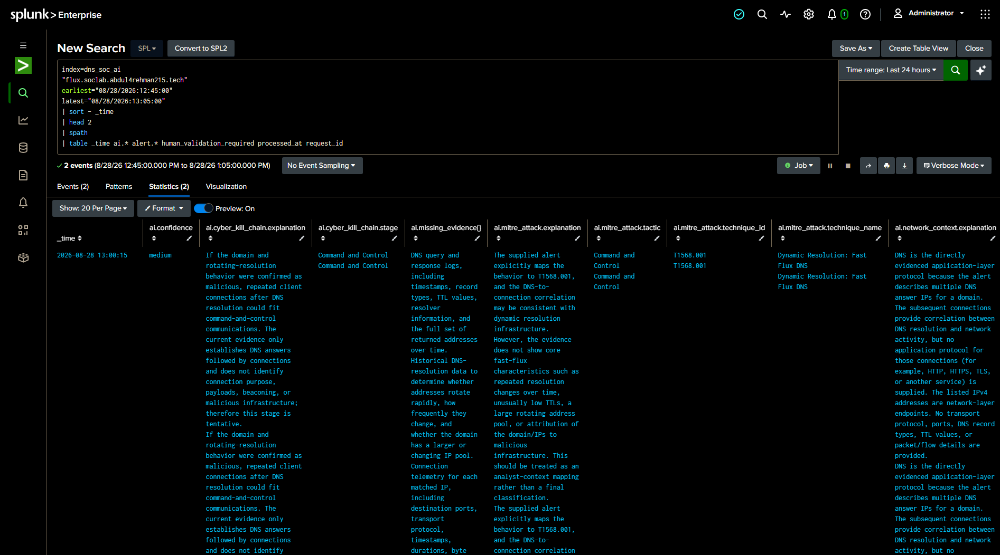
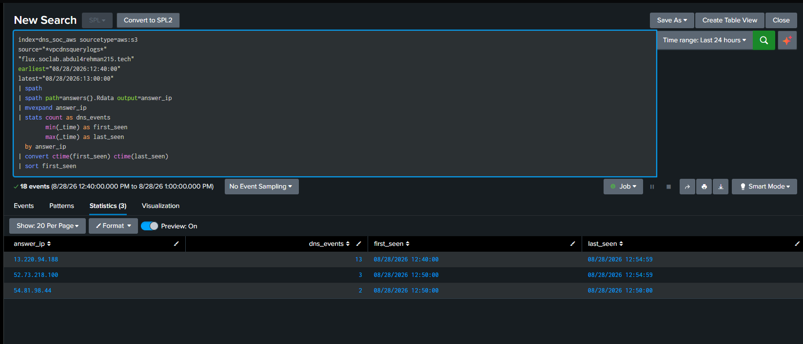
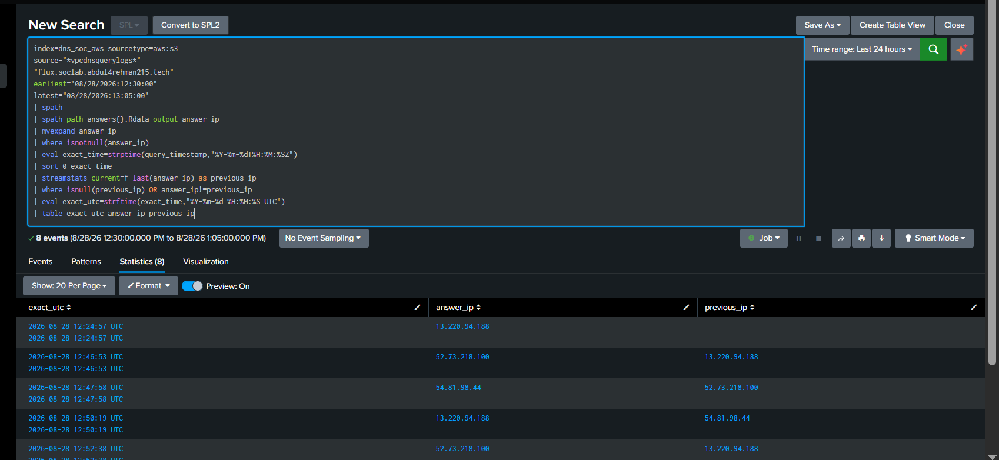
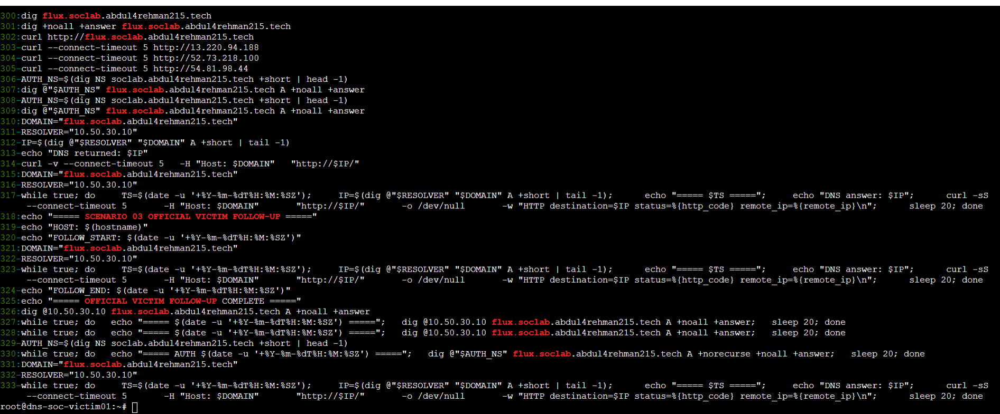
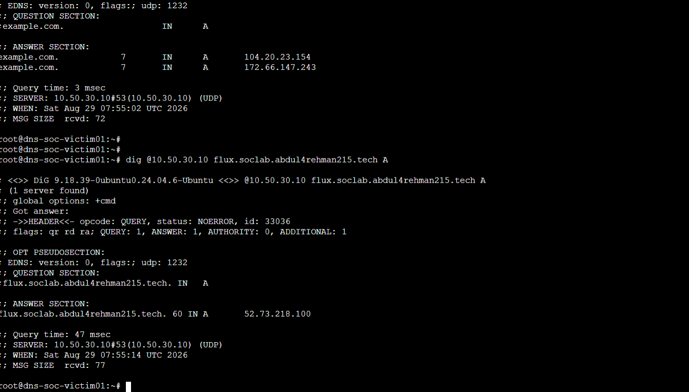

<a id="top"></a>


<div align="center">

  

[🏠 Scenario Home](README.md) · [🧾 Evidence](evidence/README.md)

</div>


# 🎬 Scenario 03 — End-to-End Execution

This is the short operational record of the completed **Fast Flux DNS** exercise. It connects the pre-built detection, official operator run, live alert, SOC investigation, Incident Response, final response decision, safe-state verification, cleanup and final reveal without reproducing every command or screenshot.

## 🧠 1. Detection Engineering was frozen before execution

Musfira had already validated the Resolver Query Log fields, VPC Flow fields, normal dynamic-service noise, DNS answer-to-destination matching, benign lookup, scheduled alert, AI evidence contract and Dashboard Studio view.

Detection v1.0 was deliberately frozen before Lubaba started the official run.

```text
5-minute window
A + NOERROR
public DNS answers
victim contacted returned IPs
unique_matched_ips >= 2
matched_connections >= 3
known benign dynamic domains excluded
```

## 🎯 2. Lubaba started the approved controller

The controller host was `dns-attack01`. Pre-flight preserved controller integrity, authoritative DNS state and the current three-node public-IP map.

| Node | Exercise-time IP |
|---|---|
| `dns-flux-node01` | `13.220.94.188` |
| `dns-flux-node02` | `52.73.218.100` |
| `dns-flux-node03` | `54.81.98.44` |

The official controller began at:

```text
2026-08-28T12:43:43Z
```



The first complete cycle moved naturally from node01 → node02 → node03 without changing the approved 120-second controller timing.



## 🌐 3. The victim genuinely followed DNS

At `12:52:18Z`, `dns-soc-victim01` started the approved follow-up loop. It resolved the stable hostname through `10.50.30.10`, then connected directly to the returned address over HTTP.

The captured sequence reached all three controlled nodes and returned HTTP `200`.



The operator stopped the victim loop at `12:58:04Z` and stopped the controller at `12:58:30Z`. A final process check confirmed the controller was no longer running.

## 🚨 4. The frozen production detection fired

The live Scenario 03 alert surfaced:

```text
Suspicious Fast Flux DNS Behavior
client: 10.50.30.20
query_name: flux.soclab.abdul4rehman215.tech
unique matched IPs: 3
MITRE: T1568.001
severity: Medium
```

The first live result exposed 36 matched connections. A later trigger for the same `12:50` event bucket showed 42. The repeated trigger was treated as an update to the same detection window rather than a second incident.



## 🔎 5. Abdul-Rehman rebuilt the case from defender evidence

The SOC investigation validated:

- repeated successful A queries through the defender resolver;
- one internal client in scope;
- allowed TCP/80 flows to all three alert destinations;
- 37 manually reviewed flow events in the narrow 12:45–12:55 window;
- scenario-domain DNS volume of 274 A-query events in 20 minutes;
- a next-highest comparison domain at 20 events;
- no match in `fastflux_benign_domains.csv`;
- AI as advisory evidence only.



The SOC did **not** have process/user attribution and the displayed Unbound events did not independently expose answer IPs. Abdul therefore locked:

> **INCONCLUSIVE — ESCALATION WARRANTED**

That was the correct professional boundary for the evidence available at the SOC stage.

## 🤖 6. AI was challenged, not trusted

The AI was graded **Partially Correct**.

It correctly preserved uncertainty, identified the client/domain/IPs, used `T1568.001`, and avoided declaring malware or confirmed malicious C2. It still relied on the production alert for part of the DNS-to-IP association and did not initially include the SOC's later baseline, scope and manual flow findings.



## 🛡️ 7. Sonia independently strengthened the DNS evidence

IR used the SOC handoff as a hypothesis, not a fact sheet.

Sonia located the defender-side Resolver Query Logs under the real AWS ingestion path, extracted `answers{}.Rdata`, and independently recovered all three A-record answers.



IR then used AWS `query_timestamp` rather than relying only on Splunk `_time` to reconstruct exact answer transitions.



Historical TTL was not exposed in the preserved Resolver Query Log events. That evidence gap was documented instead of filled with the controller's configured value.

## 🔍 8. IR investigated endpoint/context evidence

Splunk did not contain useful endpoint/process telemetry for `dns-soc-victim01`, so IR pivoted to defender-accessible Linux evidence rather than inventing process attribution.

The root shell history contained `dig` and `curl` logic matching the DNS-to-HTTP sequence and explicit Scenario 03 follow-up labels.



CloudTrail and local journal evidence showed an SSM session around 12:52 UTC, but that session started after the earliest observed traffic. Sonia therefore used the evidence to support controlled test context **without** incorrectly assigning every earlier event to that session/user.

## 🛡️ 9. Response decision — no containment

At IR decision time:

- no current matching DNS activity remained;
- no current matching VPC flows remained;
- no matching `dig` / `curl` process remained active;
- scope remained one lab client;
- host evidence strongly supported controlled Scenario 03 follow-up activity;
- no malware, compromise, malicious ownership or unauthorized intent was established.

Sonia locked:

> ## **CONTROLLED / EXPECTED SCENARIO ACTIVITY — NO CONTAINMENT REQUIRED**

The existing RPZ/sinkhole capability was not activated. No resolver policy was changed merely to produce a containment screenshot.

## ✅ ✅ 10. Safe-state verification

IR still proved that the response surface was safe:

- no Scenario 03 flux rule existed in active RPZ;
- `unbound-checkconf` passed;
- Unbound was active;
- unrelated DNS resolved from the real victim path;
- the scenario domain resolved normally to a public A record during the final check.



The live final check observed TTL `60`, but the report intentionally does not retroactively assert a historical TTL value that the preserved Resolver events did not expose.

## 🎭 11. Final reveal

After the SOC and IR decisions were locked, operator ground truth was compared with defender evidence.

```text
12:43:43Z  official controller begins
12:43:46Z  node01 UPSERT
12:45:47Z  node02 UPSERT
12:47:48Z  node03 UPSERT
12:50:00Z  production alert event bucket
12:52:18Z  victim follow-up begins
12:58:04Z  victim follow-up stops
12:58:30Z  controller stops
```

The defenders had reached their decisions without these private operator timestamps.

## 🧹 12. Post-exercise cleanup

The official controller and victim loop were stopped cleanly during the exercise. After the exercise, the three temporary Fast Flux EC2 nodes were stopped/deleted/reset as part of team closeout.

The exact EC2 teardown timestamp was not included in the preserved role evidence, so the repository records the cleanup result without inventing a timestamp.

## 🏁 ✅ Final outcome

> **Scenario 03 completed as a realistic information-separated Fast Flux detection-and-response exercise.** The controlled hostname moved across three project-owned public endpoints; the victim genuinely followed the returned destinations; the frozen Splunk detection generated a live lead; SOC independently confirmed abnormal Fast Flux-like behavior and escalated with attribution limits; IR independently strengthened DNS history and endpoint context, then correctly chose no containment; the resolver/RPZ safe state was verified; ground truth was revealed only after defender decisions were locked; and the temporary Fast Flux endpoint pool was retired after the exercise.

Continue to the deeper role stories:

- [Project Lead / Operator](attacker/PROJECT-LEAD-ADVERSARY.md)
- [Detection Engineering](detection-engineering/DETECTION-ENGINEERING.md)
- [SOC Analyst Investigation](soc/SOC-ANALYST-INVESTIGATION.md)
- [Incident Response](ir/INCIDENT-RESPONSE.md)
- [Final Comparison](exercise/final-comparison.md)


<div align="center">

[🏠 Scenario Home](README.md) · [⬆ Back to top](#top)

**Evidence before attribution. Context before containment.**

</div>


