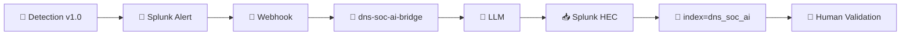

 

[🏠 Scenario Home](../README.md) · [🧠 Detection](../detection-engineering/README.md) · [🔎 SOC Validation](../soc/AI-VALIDATION.md)

# 🤖 Scenario 03 — AI-Assisted Alert Summarization

Scenario 03 reused the shared DNSentinel Flask/OpenAI/HEC bridge. No second AI service was built inside this repository.

## 🔁 Evidence Path

## ✅ What AI Got Right

- preserved client/domain and the three alert IPs;
- mapped the behavior to `T1568.001`;
- kept Command & Control as behavioral context rather than proof;
- required human validation;
- avoided declaring confirmed malware or malicious C2;
- listed important missing evidence such as TTL/history and endpoint/process context.

## ⚖️ Why the SOC Grade Stayed **Partially Correct**

- some DNS-to-IP statements depended on the production alert correlation;
- the advisory output preceded the analyst's later baseline, one-client scope, benign-lookup result and full manual VPC Flow validation;
- it could not establish malicious intent or authorize containment.

<table>
<tr>
<td width="50%"> <b>Engineering path:</b> Scenario 03 evidence returned through the shared bridge.</td>
<td width="50%"> <b>SOC validation:</b> raw AI output was inspected rather than trusted as a verdict.</td>
</tr>
</table>

## 🗂️ Artifacts

- [`scenario-03-ai-mapping.md`](scenario-03-ai-mapping.md) — scenario evidence contract
- [`ai-validation-searches.spl`](ai-validation-searches.spl) — reusable validation searches
- [`manual-webhook-test.sh`](manual-webhook-test.sh) — engineering test artifact
- [`../soc/AI-VALIDATION.md`](../soc/AI-VALIDATION.md) — official human validation record

> **Operating sequence:** raw evidence → analyst hypothesis → AI review → AI validation → human disposition.

[🏠 Scenario Home](../README.md) · [🔎 SOC Workspace](../soc/README.md) · [📖 AI Mapping](scenario-03-ai-mapping.md)

 

**AI can accelerate context. It cannot inherit decision authority.**

[⬆ Back to top](#top)

