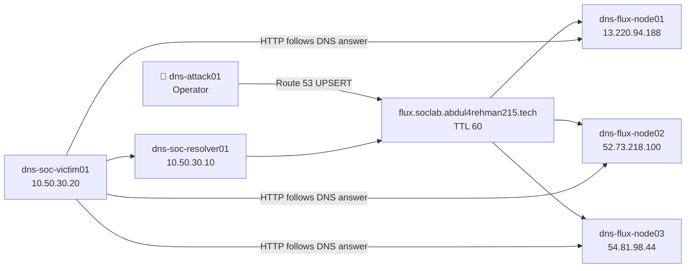
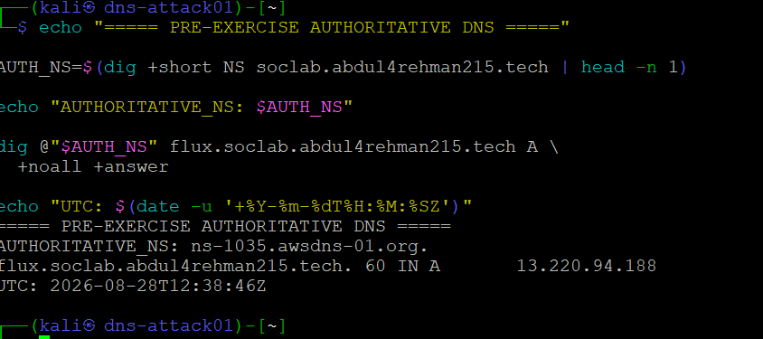
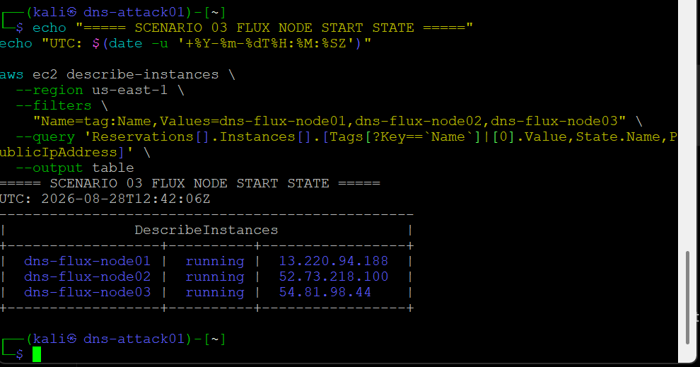
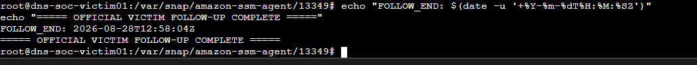
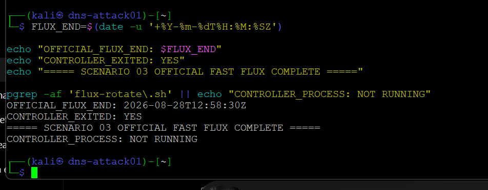

<a id="top"></a>

> 🧭 [Scenario 03](../README.md) › [Operator](README.md) › **Project Lead / Operator — Fast Flux DNS**

<div align="center">

  

</div>

# 🎯 Project Lead / Operator — Scenario 03 Fast Flux DNS

**Role owner:** [Lubaba](https://github.com/lubaba1513-pixel)  
**Scenario:** Fast Flux DNS  
**MITRE ATT&CK:** `T1568.001 — Dynamic Resolution: Fast Flux DNS`  
**Cyber Kill Chain:** Command & Control

This document records the official Scenario 03 operator journey: how Lubaba protected the exercise boundary, validated the controller before execution, generated real answer rotation across project-owned endpoints, made the victim follow those answers, and stopped the activity cleanly before the defender reveal.

The operator objective was not “make Splunk fire.” It was:

> **Run the approved Fast Flux behavior naturally, preserve ground truth, and accept whatever the frozen defender stack observed.**

## 🎯 1. Operator objective

The controlled behavior had two moving pieces:

1. `dns-attack01` rotated the project-owned Route 53 A record across three project-owned Fast Flux nodes;
2. `dns-soc-victim01` resolved the stable hostname through the defender resolver and followed the returned destination over HTTP.



## 🧭 2. Information separation

During the official run, Lubaba kept these facts private from the SOC Analyst:

```text
exact controller start/end
exact Route 53 transition sequence
controller screenshots
exercise-time node/IP map
victim follow-up timing
private operator notes
```

She also did not inspect Splunk, the dashboard, Detection v1.0, AI output or the SOC investigation to decide whether the run should continue.

That separation made the defender result meaningful.

## 🛡️ 3. Pre-flight — validate before changing DNS

Lubaba first proved she was on the correct controller host, recorded UTC, verified `/opt/dnsentinel/flux-rotate.sh`, confirmed no duplicate controller process, and checked the current authoritative DNS state.

A useful integrity issue appeared: the deployed controller SHA256 differed from the repository copy. Rather than overwriting a live exercise artifact, she stopped and validated the deployed content, Bash syntax and material settings.

The live controller was confirmed to contain the approved:

```text
region: us-east-1
record: flux.soclab.abdul4rehman215.tech
TTL: 60
nodes: dns-flux-node01 / 02 / 03
Route 53 UPSERT behavior
wait: 120 seconds
```

This preserved the exercise without hiding the provenance mismatch.

## 🌐 4. Authoritative baseline

Immediately before execution, Lubaba queried the Route 53 authority directly.



*The pre-exercise authoritative check established the current A answer and TTL without relying on a caching resolver.*

The baseline showed:

```text
A answer: 13.220.94.188
TTL: 60
```

## 🧩 5. Record the real endpoint pool

Because the Fast Flux nodes used temporary public IPv4 addresses, Lubaba recorded what actually existed at exercise time instead of trusting older engineering-validation IPs.



| Node | State | Public IPv4 |
|---|---|---|
| `dns-flux-node01` | running | `13.220.94.188` |
| `dns-flux-node02` | running | `52.73.218.100` |
| `dns-flux-node03` | running | `54.81.98.44` |

## 🎬 6. Official controller start

The official Fast Flux window began at:

```text
2026-08-28T12:43:43Z
```


*The controller identity, hash, start time and first UPSERT were preserved before the DNS-answer sequence progressed.*

The approved controller refreshed current node addresses, UPSERTed the A record, waited 120 seconds and moved to the next node.

## 🔄 7. Complete the first three-node cycle


The first captured cycle was:

```text
12:43:46Z  node01 → 13.220.94.188
12:45:47Z  node02 → 52.73.218.100
12:47:48Z  node03 → 54.81.98.44
```

The timing was not accelerated after execution began.

## 🖥️ 8. Make the victim follow DNS

The victim follow-up began at:

```text
2026-08-28T12:52:18Z
```

The loop used the defender resolver, accepted whatever A answer DNS returned, and made an HTTP request to that address with the Fast Flux hostname in the `Host` header.


*The victim moved from one DNS-returned public IP to another and received HTTP `200`; the recorded `remote_ip` matched the DNS answer.*


*The follow-up sequence reached the third controlled node as well, completing the three-destination behavior needed for the case.*

## 🛑 9. Stop cleanly

The victim loop was stopped first.



```text
FOLLOW_END: 2026-08-28T12:58:04Z
```

The controller was then stopped and checked with `pgrep`.



```text
OFFICIAL_FLUX_END: 2026-08-28T12:58:30Z
CONTROLLER_PROCESS: NOT RUNNING
```

A terminal being closed is not proof that a background process stopped; the explicit process check completed the operator record.

## 🧾 10. Ground-truth window

| Event | UTC |
|---|---|
| Official controller start | `12:43:43Z` |
| Node01 captured UPSERT | `12:43:46Z` |
| Node02 captured UPSERT | `12:45:47Z` |
| Node03 captured UPSERT | `12:47:48Z` |
| Victim follow-up start | `12:52:18Z` |
| Victim follow-up end | `12:58:04Z` |
| Official controller end | `12:58:30Z` |

The complete reveal-ready timeline is preserved in [`GROUND-TRUTH.md`](GROUND-TRUTH.md).

## 🧹 11. Post-exercise cleanup

The controller and victim loop were already stopped during the official run. After the exercise, the three temporary Fast Flux EC2 nodes were stopped/deleted/reset as part of closeout.

The preserved evidence package does not contain the exact node teardown timestamp, so this document records the cleanup result without manufacturing one.

## 💡 12. Operator lessons

- Bind every command to the correct role and host before execution.
- A hash mismatch should trigger validation, not an unreviewed live replacement.
- Authoritative DNS checks and resolver checks answer different questions.
- Do not tune activity after the start gate to satisfy a detection threshold.
- Preserve exact UTC timing privately; reveal it only after defender decisions are locked.
- A successful operator run ends with proof that the activity stopped.
- Temporary infrastructure belongs to the exercise lifecycle and should be retired when it is no longer needed.

## 🗂️ Related files

- [`COMMANDS.md`](COMMANDS.md) — command index
- [`commands/`](commands/) — exact executable command files
- [`GROUND-TRUTH.md`](GROUND-TRUTH.md) — final reveal timeline
- [`SCENARIO-03-ADVERSARY-PLAYBOOK.md`](SCENARIO-03-ADVERSARY-PLAYBOOK.md) — pre-approved protocol
- [`../SCENARIO-03-EXECUTION.md`](../SCENARIO-03-EXECUTION.md) — end-to-end case
- [`../exercise/final-comparison.md`](../exercise/final-comparison.md) — operator vs defender comparison

<div align="center">

**Lubaba · Preserve the boundary. Generate the behavior. Let the defenders prove the rest.**

[🏠 Scenario Home](../README.md) · [⬆ Back to top](#top)

</div>
