  

[🏠 Scenario Home](../README.md) · [🎬 Execution](../SCENARIO-03-EXECUTION.md) · [🧾 Evidence](evidence/README.md) · [🎭 Exercise](../exercise/README.md)

# 🎯 Scenario 03 Operator Workspace

Lubaba owned the official Fast Flux execution boundary: artifact validation, authoritative pre-flight, controlled Route 53 rotation, real victim follow-up, clean shutdown, private ground-truth discipline and final reveal.

> [!IMPORTANT]
> The operator did **not** use Splunk results to steer the run. Approved timing/controller logic stayed frozen.

## 🚦 Execution Snapshot

| Field | Result |
|---|---|
| Controller | `dns-attack01` |
| Controller window | `12:43:43Z → 12:58:30Z` |
| Victim follow-up | `12:52:18Z → 12:58:04Z` |
| Controlled destinations | 3 public nodes |
| Victim behavior | DNS resolve → HTTP follow-up |
| HTTP outcome | `200` observed |
| Stop proof | victim loop + controller stopped cleanly |
| Cleanup | temporary flux EC2 pool retired after exercise |

## 🔁 Operator Flow

```mermaid
%%{init: {
  "theme": "base",
  "themeVariables": {
    "background": "#050814",
    "primaryTextColor": "#ffffff",
    "lineColor": "#dbeafe",
    "fontSize": "30px"
  },
  "flowchart": {
    "nodeSpacing": 44,
    "rankSpacing": 70,
    "curve": "basis",
    "padding": 20
  }
}}%%

flowchart LR

    A["🔐 01 · PREFLIGHT"]
    B["🌐 02 · AUTHORITATIVE<br/>BASELINE"]
    C["⚙️ 03 · START<br/>CONTROLLER"]
    D["🧭 04 · COMPLETE<br/>3-NODE ROTATION"]
    E["🖥️ 05 · VICTIM<br/>FOLLOW-UP"]
    F["🛑 06 · STOP<br/>VICTIM"]
    G["🛑 07 · STOP<br/>CONTROLLER"]
    H["🧾 08 · PRESERVE<br/>GROUND TRUTH"]
    I["🎭 09 · FINAL<br/>REVEAL"]

    A ==> B ==> C ==> D ==> E ==> F ==> G ==> H ==> I

    classDef prep fill:#112b6b,stroke:#60a5fa,stroke-width:5px,color:#ffffff,font-size:30px;
    classDef baseline fill:#063b56,stroke:#22d3ee,stroke-width:5px,color:#ffffff,font-size:30px;
    classDef control fill:#4c1d95,stroke:#c084fc,stroke-width:5px,color:#ffffff,font-size:30px;
    classDef rotation fill:#7c2d12,stroke:#fb923c,stroke-width:5px,color:#ffffff,font-size:30px;
    classDef victim fill:#065f46,stroke:#4ade80,stroke-width:5px,color:#ffffff,font-size:30px;
    classDef stop fill:#8b1e3f,stroke:#fb7185,stroke-width:5px,color:#ffffff,font-size:30px;
    classDef preserve fill:#713f12,stroke:#facc15,stroke-width:5px,color:#ffffff,font-size:30px;
    classDef reveal fill:#1e1b4b,stroke:#a78bfa,stroke-width:5px,color:#ffffff,font-size:30px;

    class A prep;
    class B baseline;
    class C control;
    class D rotation;
    class E victim;
    class F,G stop;
    class H preserve;
    class I reveal;

    linkStyle default stroke:#e5f3ff,stroke-width:4px;
```

## 🖼️ Official Evidence Highlights

<table>
<tr>
<td width="33%"> <b>Baseline:</b> authoritative state before the official rotation.</td>
<td width="33%"> <b>Start:</b> controller identity and first official transition.</td>
<td width="33%"> <b>Rotation:</b> first complete three-node cycle.</td>
</tr>
<tr>
<td width="50%" colspan="1"> <b>Follow-up:</b> victim reached the returned destination successfully.</td>
<td width="50%" colspan="2"> <b>Clean stop:</b> controller shutdown and process absence were preserved.</td>
</tr>
</table>

## 🗂️ Start Here

- [`PROJECT-LEAD-ADVERSARY.md`](PROJECT-LEAD-ADVERSARY.md) — flagship operator story
- [`GROUND-TRUTH.md`](GROUND-TRUTH.md) — reveal-ready final timeline
- [`COMMANDS.md`](COMMANDS.md) — command/host ownership index
- [`SCENARIO-03-ADVERSARY-PLAYBOOK.md`](SCENARIO-03-ADVERSARY-PLAYBOOK.md) — approved protocol
- [`TROUBLESHOOTING-AND-LESSONS.md`](TROUBLESHOOTING-AND-LESSONS.md) — execution integrity lessons
- [`evidence/`](evidence/) — curated reveal-ready evidence
- [`commands/`](commands/) — exact preserved operator command files

> **Operator boundary:** prove what was intentionally generated. Let defenders prove what they could establish independently.

[🏠 Scenario Home](../README.md) · [📖 Operator Story](PROJECT-LEAD-ADVERSARY.md) · [🧾 Evidence](evidence/README.md)

 

**Preserve the boundary. Generate the behavior. Let the defenders prove the rest.**

[⬆ Back to top](#top)

