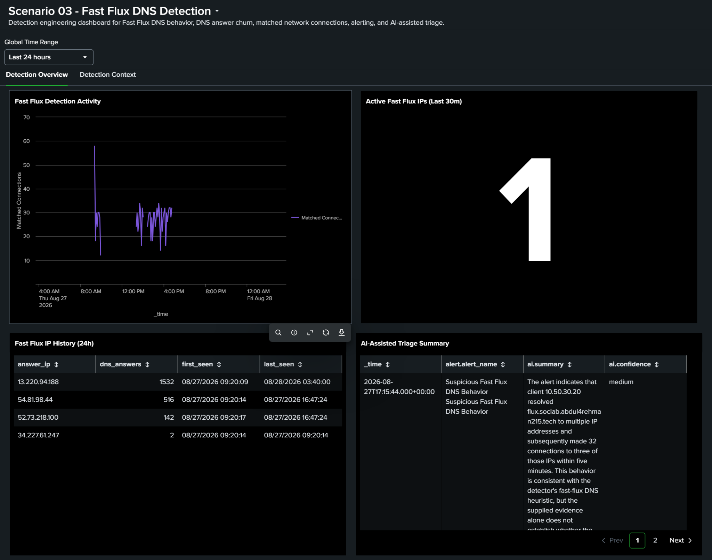
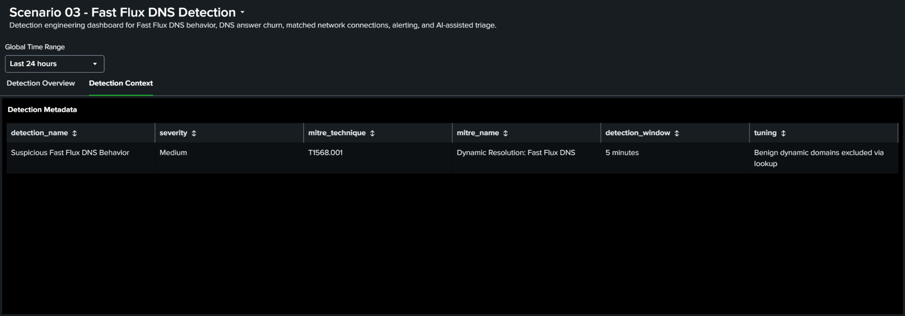

# Scenario 03 Dashboard Studio

**Status:** ✅ Implemented and validated  
**Title:** `Scenario 03 - Fast Flux DNS Detection`

The final Dashboard Studio JSON export is [`scenario-03-fast-flux-detection.dashboard.json`](scenario-03-fast-flux-detection.dashboard.json).

## Tabs and panels

### Detection Overview

1. [`Fast Flux Detection Activity`](panels/panel-01-fast-flux-detection-activity.spl)
2. [`Active Fast Flux IPs (Last 30m)`](panels/panel-02-active-fast-flux-ips.spl)
3. [`Fast Flux IP History (24h)`](panels/panel-03-fast-flux-ip-history.spl)
4. [`AI-Assisted Triage Summary`](panels/panel-04-ai-assisted-triage-summary.spl)

### Detection Context

5. [`Detection Metadata`](panels/panel-05-detection-metadata.spl)

