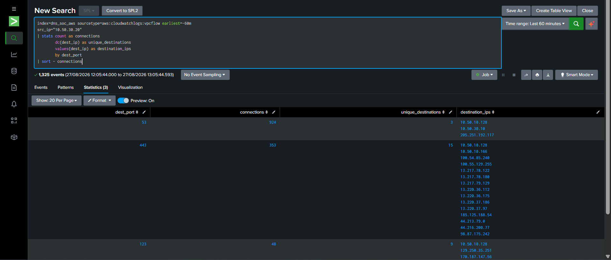

<a id="top"></a>


<div align="center">

  

[🏠 Scenario Home](../README.md) · [🧠 Workspace](README.md) · [🧾 Evidence](../evidence/README.md)

</div>


# 🧠 Scenario 03 Detection Engineering — [Musfira](https://github.com/MUSFIRA-ZAFAR)

**Status:** ✅ Complete and validated end to end  
**Detection:** `Suspicious Fast Flux DNS Behavior`  
**MITRE:** `T1568.001 — Dynamic Resolution: Fast Flux DNS`  
**Severity:** Medium

## 📌 Mission

Turn the controlled Fast Flux infrastructure into a detection that can survive normal cloud/CDN behavior. The final rule had to use telemetry the lab actually possessed, correlate DNS and network entities directly, explain its thresholds, and produce analyst-ready evidence.

## 📌 1. Start with the data

The first step was not writing a detection. Musfira validated the actual fields available from:

- Unbound DNS logs in `index=dns_soc_dns`;
- VPC Flow Logs in `index=dns_soc_aws sourcetype=aws:cloudwatchlogs:vpcflow`;
- Route 53 Resolver Query Logs delivered to S3 and ingested as `sourcetype=aws:s3`.

Resolver Query Logs became the decisive source because `answers{}.Rdata` exposed the real returned IP addresses.


## 📊 2. Baseline before threshold

The victim already generated ordinary multi-destination traffic on DNS, HTTPS, NTP and other services. This mattered because a generic rule such as `dc(dest_ip)>=2` would be noisy.

The baseline searches are preserved in [`../spl/baseline.spl`](../spl/baseline.spl).



## 🔎 3. Hunt destination churn

A first useful hunt counted public HTTP destinations in five-minute windows. The early version accidentally included private traffic such as an RFC1918 address, so the population was tightened before the result was trusted.

That led to a stable hunting observation: the controlled victim reached two or three public Fast Flux nodes in short windows.

## 📌 4. Move from time correlation to entity correlation

The first Unbound-based prototype could only say:

```text
DNS happened near changing network traffic
```

That was not enough. Once Resolver Query Logs were inspected, the search could instead ask:

```text
DNS returned IP X
+
victim connected to IP X
```

This was the key improvement. The detection stopped relying on timing alone and began correlating on `answer_ip`.

## 📌 5. Prove that churn alone is noisy

The generic answer-churn hunt also surfaced legitimate services including AWS SSM, GuardDuty, S3, Route 53, Ubuntu ESM and `quickdraw.splunk.com`.


This confirmed the central Scenario 03 lesson: **dynamic DNS is a behavior to investigate, not a verdict.**

## 📌 6. Reject attractive but weak features

Two possible discriminators were tested and rejected:

- **one answer per response:** the data did not cleanly separate the lab domain from SSM;
- **higher churn rate:** legitimate SSM behavior could be more dynamic than the small lab Fast Flux pool.

Discarding features that did not survive testing made the final rule more credible.

## 📌 7. Tune known benign dynamic infrastructure

Known benign dynamic services observed during engineering were moved into [`../spl/fastflux_benign_domains.csv`](../spl/fastflux_benign_domains.csv) rather than hard-coded into the SPL.

Current engineering lookup:

| Domain | Reason |
|---|---|
| `ssm.us-east-1.amazonaws.com` | AWS Systems Manager |
| `guardduty-data.us-east-1.amazonaws.com` | AWS GuardDuty |
| `s3.us-east-1.amazonaws.com` | AWS S3 |
| `route53.amazonaws.com` | AWS Route 53 |
| `esm.ubuntu.com` | Ubuntu ESM |
| `quickdraw.splunk.com` | Splunk service |

The lookup is a lab tuning artifact, not a universal enterprise allowlist.

## 🧠 8. Freeze Detection v1.0

The final rule uses a five-minute bucket and requires both DNS and network evidence:

```text
DNS A / NOERROR
returned public answer IP
victim network connection to same IP
>= 2 unique matched IPs
>= 3 matched connections
RFC1918 excluded
known benign dynamic domains excluded
```

The canonical SPL is [`../spl/detection.spl`](../spl/detection.spl).


### 📌 Known limitation

The lab implementation pins the VPC Flow subsearch to victim `10.50.30.20`. An enterprise-generalized version should normalize and derive client identity rather than hard-code a single lab endpoint.

## 🚨 9. Productionize it as a scheduled alert

The work did not stop when the search returned rows. The rule was saved as a scheduled alert:

- **Title:** Suspicious Fast Flux DNS Behavior
- **Cron:** `*/5 * * * *`
- **Trigger:** Number of Results > 0
- **Trigger mode:** Once
- **Severity:** Medium
- **Actions:** Triggered Alerts + Webhook

See [`../spl/scheduled-alert.md`](../spl/scheduled-alert.md).


## 🤖 10. Fit the shared AI contract

The shared bridge already existed. Scenario 03 had to emit the fields its normalizer expected:

```text
alert_id
alert_name
scenario
severity
event_time
source
evidence_json
```

After the schema was corrected, manual POST validation returned HTTP 200 and scheduled Scenario 03 alerts produced AI summaries in `index=dns_soc_ai`.

AI remained advisory. Its Medium-confidence summary described Fast Flux-like evidence without claiming maliciousness from DNS churn alone.

See [`../ai/scenario-03-ai-mapping.md`](../ai/scenario-03-ai-mapping.md).

## 📌 11. Build the analyst surface

Dashboard Studio was built with two tabs and five panels:

**Detection Overview**
1. Fast Flux Detection Activity
2. Active Fast Flux IPs (Last 30m)
3. Fast Flux IP History (24h)
4. AI-Assisted Triage Summary

**Detection Context**
5. Detection Metadata

The final JSON export is [`../dashboard/scenario-03-fast-flux-detection.dashboard.json`](../dashboard/scenario-03-fast-flux-detection.dashboard.json).


## 📌 Engineering reflection

The hardest part was not writing SPL syntax. Several results initially looked like detection failures but were actually data-window, scoping, telemetry-shape, lookup-quality or application-contract problems. Musfira repeatedly worked backward from the observed evidence, protected known-good layers, and changed the rule only when the data justified it.

By the end of the phase, the detection was no longer “find changing IPs.” It had become a correlation rule with explicit false-positive boundaries, a scheduled operational path, an AI evidence contract and an analyst dashboard.

## 📨 Handoff and official-run outcome

Detection Engineering was frozen before the official exercise and remained unchanged while Lubaba generated the controlled Fast Flux behavior. The production alert then surfaced the official Scenario 03 lead for Abdul-Rehman's independent SOC investigation.

The completed downstream chain is now:

- **Lubaba:** official controlled rotation + private ground truth — complete;
- **Abdul-Rehman:** SOC investigation — `INCONCLUSIVE — ESCALATION WARRANTED`;
- **Sonia:** IR / Defender — `CONTROLLED / EXPECTED SCENARIO ACTIVITY — NO CONTAINMENT REQUIRED`.

The later defender results do not change the Detection Engineering conclusion: Detection v1.0 successfully surfaced the Fast Flux-like behavior while preserving the need for human context and attribution.


<div align="center">

[🏠 Scenario Home](../README.md) · [🧠 Workspace](README.md) · [⬆ Back to top](#top)

**Evidence before attribution. Context before containment.**

</div>


