   

[🏠 Scenario Home](../README.md) · [📊 Dashboard](../dashboard/README.md) · [🔎 SPL](../spl/README.md) · [🤖 AI](../ai/README.md) · [🧾 Evidence](../evidence/README.md)

# 🧠 Fast Flux Detection Engineering Workspace

**Detection Engineer:** [Musfira](https://github.com/MUSFIRA-ZAFAR)  
**Primary MITRE:** `T1568.001 — Dynamic Resolution: Fast Flux DNS`  
**Production rule:** `Suspicious Fast Flux DNS Behavior` · `v1.0`  
**Status:** **✅ Frozen before the official run and exercised successfully**

The engineering goal was not to alert on “a domain has several A records.” Legitimate AWS, Ubuntu and Splunk services also changed answers. The final rule therefore correlates **public DNS answers with destinations the victim actually contacted**, then excludes known benign dynamic domains.

## 🚦 Engineering Snapshot

| Field | Final state |
|---|---|
| Resolver evidence | A + `NOERROR` reply-side telemetry |
| Network evidence | VPC Flow destinations from `10.50.30.20` |
| Behavioral window | 5 minutes |
| Minimum matched public answers | `2+` |
| Minimum matched connections | `3+` |
| Tuning | RFC1918 excluded + benign dynamic-domain lookup |
| Official result | live production alert during Lubaba's frozen run |
| Human boundary | Detection created the lead; SOC/IR decided meaning and response |

## 🔁 Engineering Path

```mermaid
%%{init: {
  "theme": "base",
  "themeVariables": {
    "background": "#030712",
    "primaryTextColor": "#ffffff",
    "lineColor": "#f8fafc",
    "fontSize": "29px"
  },
  "flowchart": {
    "nodeSpacing": 48,
    "rankSpacing": 58,
    "curve": "basis",
    "padding": 20
  }
}}%%

flowchart LR

    %% =====================================================
    %% 1 · DATA FOUNDATION
    %% =====================================================
    subgraph FOUNDATION[" "]
        direction TB

        H1["📡 1 · DATA FOUNDATION"]

        A["📡 VALIDATE<br/>Resolver + Flow Fields"]

        B["📊 BASELINE<br/>Normal Dynamic DNS"]

        C["🧪 CHALLENGE<br/>Weak Churn Features"]

        H1 ==> A ==> B ==> C
    end


    %% =====================================================
    %% 2 · DETECTION ENGINEERING
    %% =====================================================
    subgraph ENGINEERING[" "]
        direction TB

        H2["🛠️ 2 · DETECTION ENGINEERING"]

        D["🔗 CORRELATE<br/>Answers ↔ Destinations"]

        E["🧹 TUNE<br/>RFC1918 + Benign Lookup"]

        F["🧠 FREEZE<br/>Detection v1.0"]

        H2 ==> D ==> E ==> F
    end


    %% =====================================================
    %% 3 · SOC DELIVERY
    %% =====================================================
    subgraph SOCFLOW[" "]
        direction TB

        H3["🛡️ 3 · SOC DELIVERY"]

        G["🚨 SCHEDULED ALERT<br/>Production Detection"]

        H["🤖 AI EVIDENCE<br/>Contract"]

        I["🔎 SOC INVESTIGATION<br/>Human Validation"]

        H3 ==> G ==> H ==> I
    end


    %% =====================================================
    %% KEEP THE THREE STAGES PARALLEL
    %% =====================================================
    FOUNDATION ==> ENGINEERING
    ENGINEERING ==> SOCFLOW


    %% =====================================================
    %% PREMIUM NEON HEADERS
    %% =====================================================
    classDef dataHeader fill:#075985,stroke:#67e8f9,stroke-width:7px,color:#ffffff,font-size:34px,font-weight:bold;

    classDef engHeader fill:#7c2d12,stroke:#fb923c,stroke-width:7px,color:#ffffff,font-size:34px,font-weight:bold;

    classDef socHeader fill:#4c1d95,stroke:#e879f9,stroke-width:7px,color:#ffffff,font-size:34px,font-weight:bold;

    class H1 dataHeader;
    class H2 engHeader;
    class H3 socHeader;


    %% =====================================================
    %% DATA FOUNDATION COLORS
    %% =====================================================
    classDef validate fill:#0c4a6e,stroke:#22d3ee,stroke-width:6px,color:#ffffff,font-size:29px,font-weight:bold;

    classDef baseline fill:#172554,stroke:#60a5fa,stroke-width:6px,color:#ffffff,font-size:29px,font-weight:bold;

    classDef challenge fill:#4338ca,stroke:#a5b4fc,stroke-width:6px,color:#ffffff,font-size:29px,font-weight:bold;

    class A validate;
    class B baseline;
    class C challenge;


    %% =====================================================
    %% DETECTION ENGINEERING COLORS
    %% =====================================================
    classDef correlate fill:#78350f,stroke:#fbbf24,stroke-width:6px,color:#ffffff,font-size:29px,font-weight:bold;

    classDef tune fill:#9a3412,stroke:#fb923c,stroke-width:6px,color:#ffffff,font-size:29px,font-weight:bold;

    classDef freeze fill:#7f1d1d,stroke:#fb7185,stroke-width:6px,color:#ffffff,font-size:29px,font-weight:bold;

    class D correlate;
    class E tune;
    class F freeze;


    %% =====================================================
    %% SOC DELIVERY COLORS
    %% =====================================================
    classDef alert fill:#991b1b,stroke:#f87171,stroke-width:6px,color:#ffffff,font-size:29px,font-weight:bold;

    classDef ai fill:#581c87,stroke:#f0abfc,stroke-width:6px,color:#ffffff,font-size:29px,font-weight:bold;

    classDef investigation fill:#065f46,stroke:#4ade80,stroke-width:7px,color:#ffffff,font-size:29px,font-weight:bold;

    class G alert;
    class H ai;
    class I investigation;


    %% =====================================================
    %% GLOSSY PANELS
    %% =====================================================
    style FOUNDATION fill:#051521,stroke:#22d3ee,stroke-width:4px

    style ENGINEERING fill:#180d05,stroke:#fb923c,stroke-width:4px

    style SOCFLOW fill:#150821,stroke:#d946ef,stroke-width:4px


    %% =====================================================
    %% BRIGHT CONNECTORS
    %% =====================================================
    linkStyle default stroke:#f8fafc,stroke-width:6px;
```

## 🖼️ Engineering Evidence Highlights

<table>
<tr>
<td width="33%"> <b>Resolver semantics:</b> answer-IP extraction validated from the defender DNS path.</td>
<td width="33%"> <b>Correlation:</b> returned public answers matched to victim destinations.</td>
<td width="33%"> <b>Detection v1.0:</b> final correlated rule after weak discriminators were rejected.</td>
</tr>
<tr>
<td width="33%"> <b>Operationalization:</b> scheduled alert surfaced in Splunk.</td>
<td width="33%"> <b>AI path:</b> structured triage evidence returned to Splunk.</td>
<td width="33%"> <b>Analyst surface:</b> Detection Overview assembled the investigation signals.</td>
</tr>
</table>

## 🗂️ Start Here

| Artifact | Purpose |
|---|---|
| [`DETECTION-ENGINEERING.md`](DETECTION-ENGINEERING.md) | flagship engineering story |
| [`detection-engineering-validation.md`](detection-engineering-validation.md) | compact PASS/acceptance record |
| [`TROUBLESHOOTING-AND-LESSONS.md`](TROUBLESHOOTING-AND-LESSONS.md) | why tempting shortcuts were rejected |
| [`SOC-ANALYST-HANDOFF.md`](SOC-ANALYST-HANDOFF.md) | field/alert contract given to SOC |
| [`DETECTION-ENGINEERING-CLOSEOUT.md`](DETECTION-ENGINEERING-CLOSEOUT.md) | phase closeout and known limitation |
| [`../spl/`](../spl/) | canonical baseline, hunting, detection and validation SPL |
| [`../dashboard/`](../dashboard/) | Dashboard Studio JSON and panels |

> **Engineering principle:** DNS churn is context. Correlated behavior is the signal.

[🏠 Scenario Home](../README.md) · [📖 Engineering Story](DETECTION-ENGINEERING.md) · [📊 Dashboard](../dashboard/README.md) · [🔎 SPL](../spl/README.md)

 

**Challenge the feature. Correlate the evidence. Freeze only what survives validation.**

[⬆ Back to top](#top)

