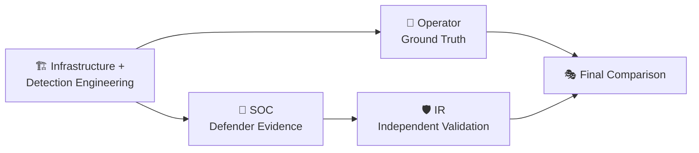

 

[🏠 Scenario Home](../README.md) · [🎯 Operator](../attacker/evidence/README.md) · [🔎 SOC](../soc/evidence/README.md) · [🛡️ IR](../ir/evidence/README.md)

# 🧾 Scenario 03 — Evidence Center

This workspace connects the evidence preserved by each role **without flattening the case into one screenshot dump**.

## 🔁 Evidence Architecture

## 🖼️ Cross-Role Highlights

<table>
<tr>
<td width="25%"> <b>Engineering:</b> frozen correlated Fast Flux detection.</td>
<td width="25%"> <b>Operator:</b> complete controlled rotation.</td>
<td width="25%"> <b>SOC:</b> defender network validation.</td>
<td width="25%"> <b>IR:</b> final authorized-client DNS verification.</td>
</tr>
</table>

## 🏗️ Infrastructure / Detection Engineering

- [`../screenshots/infrastructure/`](../screenshots/infrastructure/) — endpoint pool, Route 53, rotation, authoritative validation, victim follow-up and VPC Flow proof
- [`../screenshots/detection-engineering/`](../screenshots/detection-engineering/) — field validation, baseline, answer extraction, tuning, final detection, alert, AI and dashboard
- [`ENGINEERING-EVIDENCE-MANIFEST.md`](ENGINEERING-EVIDENCE-MANIFEST.md) / [`ENGINEERING-EVIDENCE-MANIFEST.csv`](ENGINEERING-EVIDENCE-MANIFEST.csv) — engineering integrity index
- [`engineering-validation/`](engineering-validation/) — preserved validated engineering/test scripts

## 🎯 Operator Ground Truth

- [`../attacker/evidence/README.md`](../attacker/evidence/README.md) — reveal-ready operator evidence
- [`../attacker/GROUND-TRUTH.md`](../attacker/GROUND-TRUTH.md) — official operator timeline

## 🔎 SOC Investigation

- [`../soc/evidence/README.md`](../soc/evidence/README.md) — E01–E18 defender investigation set
- [`../soc/SOC-ANALYST-INVESTIGATION.md`](../soc/SOC-ANALYST-INVESTIGATION.md) — full analyst story

## 🛡️ IR Independent Validation

- [`../ir/evidence/README.md`](../ir/evidence/README.md) — defender-response evidence
- [`../ir/INCIDENT-RESPONSE.md`](../ir/INCIDENT-RESPONSE.md) — full IR story

## 🎭 Final Comparison

- [`../exercise/final-comparison.md`](../exercise/final-comparison.md) — operator ground truth vs Detection v1.0 vs AI vs SOC vs IR
- [`CLAIM-TO-EVIDENCE-MAP.md`](CLAIM-TO-EVIDENCE-MAP.md) — claim-strength boundary
- [`FINAL-CLOSEOUT-MANIFEST.md`](FINAL-CLOSEOUT-MANIFEST.md) / [`FINAL-CLOSEOUT-MANIFEST.csv`](FINAL-CLOSEOUT-MANIFEST.csv) — final closeout integrity index

> **Evidence rule:** a public statement should be no stronger than the artifact that supports it.

[🏠 Scenario Home](../README.md) · [🎭 Final Comparison](../exercise/final-comparison.md) · [🖼️ Screenshot Portal](../screenshots/README.md)

 

**Preserve the source. Explain the claim. Keep the boundary visible.**

[⬆ Back to top](#top)

