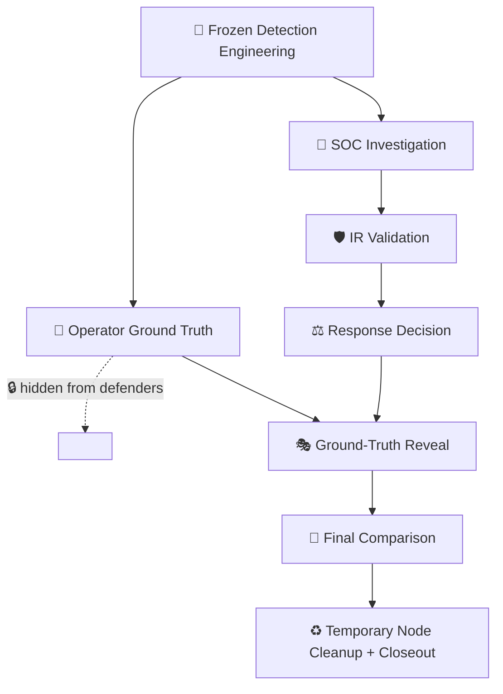

 

[🏠 Scenario Home](../README.md) · [🎬 Execution](../SCENARIO-03-EXECUTION.md) · [🧾 Evidence](../evidence/README.md) · [🎭 Final Comparison](final-comparison.md)

# 🎭 Scenario 03 — Exercise Control

The scenario was designed so each role could only claim what its evidence supported at that stage. Operator ground truth stayed hidden until the SOC disposition and IR response decision were locked.

## 🔐 Information-Separation Model

## ✅ Completed Gates

| Gate | Result |
|---|---|
| Engineering frozen before official execution | ✅ |
| Operator run completed without Splunk steering | ✅ |
| SOC disposition locked before reveal | ✅ |
| IR decision locked before reveal | ✅ |
| Resolver/RPZ safe state verified | ✅ |
| Ground truth compared only after decisions | ✅ |
| Temporary node cleanup recorded | ✅ |

## 🗂️ Files

- [`REALISTIC-EXERCISE-PROTOCOL.md`](REALISTIC-EXERCISE-PROTOCOL.md) — execution/reveal rules
- [`final-comparison.md`](final-comparison.md) — operator vs Detection vs AI vs SOC vs IR

> **Why this matters:** different conclusions can all be correct when roles possess different evidence at different times.

[🏠 Scenario Home](../README.md) · [🎭 Final Comparison](final-comparison.md) · [🧾 Evidence](../evidence/README.md)

 

**Evidence boundaries make the exercise realistic; the reveal makes the learning measurable.**

[⬆ Back to top](#top)

