<a id="top"></a>


<div align="center">

  

[🏠 Scenario Home](../README.md) · [🛡️ Workspace](README.md) · [🧾 Evidence](../evidence/README.md)

</div>


**Incident Responder / Defender:** [Sonia](https://github.com/sonia11mansha415)  
**SOC handoff:** `INCONCLUSIVE — ESCALATION WARRANTED`  
**Final IR disposition:** **CONTROLLED / EXPECTED SCENARIO ACTIVITY — NO CONTAINMENT REQUIRED**  
**MITRE:** `T1568.001 — Dynamic Resolution: Fast Flux DNS`

Sonia entered the case after Abdul-Rehman had already confirmed abnormal Fast Flux-like DNS/network behavior but could not prove process identity, user identity, malicious ownership or unauthorized intent.

Her job was therefore not “turn on RPZ.” It was:

> **Independently strengthen the evidence, determine current risk, find whatever host/context evidence legitimately exists, and respond only if an enforcing action is proportionate.**

## 📥 1. Start from the SOC handoff — but trust nothing blindly

The handoff reported:

```text
client: 10.50.30.20 / dns-soc-victim01
resolver: 10.50.30.10 / dns-soc-resolver01
domain: flux.soclab.abdul4rehman215.tech
three alert-associated public IPs
one-client SOC scope
274 A-query events
SOC disposition: INCONCLUSIVE — ESCALATION WARRANTED
```

IR treated those as claims to reproduce, not facts to copy.

## 🔎 2. Find the stronger DNS source

The SOC had a real limitation: its visible Unbound events did not expose the returned IPv4 answer values.

Sonia inventoried the real `dns_soc_aws` sourcetypes and located Resolver Query Logs under the generic AWS S3 ingestion path rather than inventing a new sourcetype.

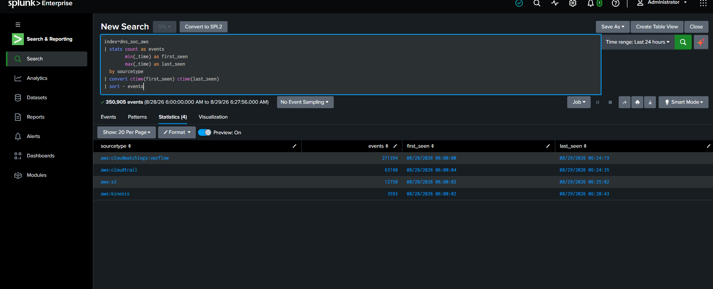

*The evidence source was discovered from the actual environment before IR wrote answer-history searches.*

## 🌐 3. Independently recover all three DNS answers

Resolver Query Logs exposed the actual returned A-record IPs:

```text
13.220.94.188
52.73.218.100
54.81.98.44
```


*This closed the SOC's biggest DNS evidence gap: IR independently recovered the three answer IPs rather than inheriting them from the production detection.*

## 🕒 4. Build the answer-transition chronology from source-native time

Sonia discovered that Splunk `_time` was not the best forensic timestamp for Resolver chronology. The AWS JSON carried its own `query_timestamp`, so IR parsed and sorted on that field.


Representative transitions included:

```text
12:24:57 → 13.220.94.188
12:46:53 → 52.73.218.100
12:47:58 → 54.81.98.44
12:50:19 → 13.220.94.188
12:52:38 → 52.73.218.100
```

This is stronger than copying the operator timeline because it was derived entirely from defender telemetry.

## 📌 ⏱️ 5. Preserve the historical TTL limitation

Historical Resolver Query Log events did not expose a TTL field in the preserved data.

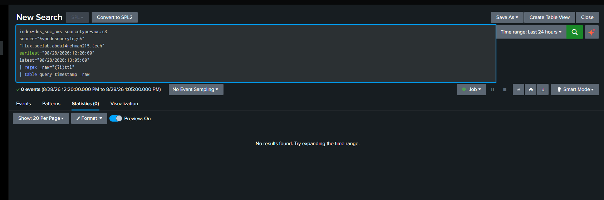

IR therefore did **not** write:

```text
Historical TTL was 60 seconds throughout the incident.
```

A later live defender query observed TTL 60, but the historical and live facts remain separate.

## 🔗 6. Independently validate DNS-to-network follow-up

IR confirmed that the victim contacted all three DNS-answer IPs over allowed TCP/80.

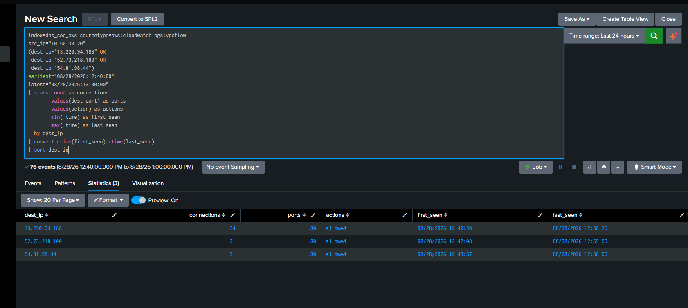

The IR window was wider than the SOC's manual 10-minute window, so its flow total differed. That was preserved as an analysis-window difference rather than treated as an error.

## 🎯 7. Scope the affected client

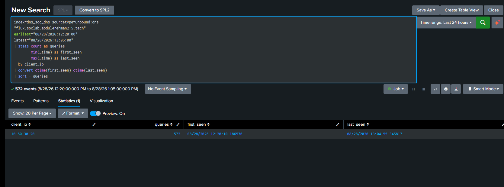

The expanded Unbound review still showed only:

```text
10.50.30.20 / dns-soc-victim01
```

No second internal client was pulled into the case merely because the domain was dynamic.

## 🛑 8. Determine whether the behavior is still active

Before considering containment, IR checked the current state.

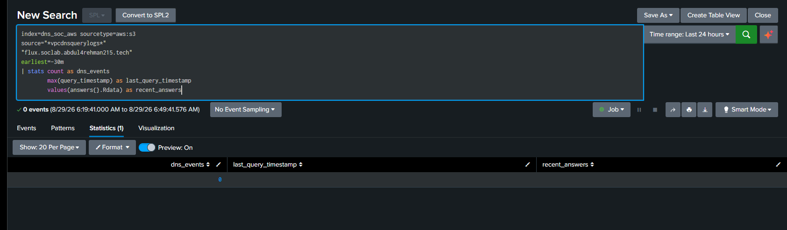

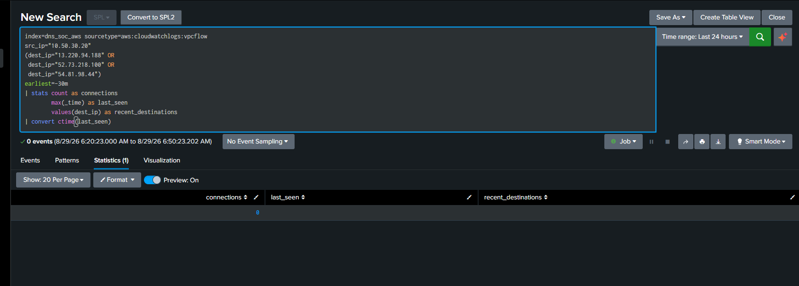

At decision time, the Scenario 03 DNS/network pattern was historical rather than actively continuing.

## 🧩 9. Splunk could not answer the process question

A direct hostname search showed that useful endpoint/process telemetry for `dns-soc-victim01` was not present in Splunk.

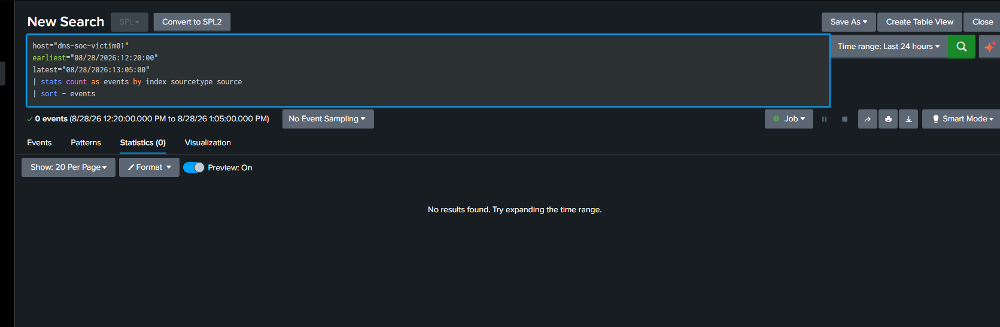

This was not filled with guesswork. Sonia pivoted to defender-accessible local Linux evidence.

## 🖥️ 10. Pivot to the victim host

Local journal evidence showed an interactive SSM-to-root sequence at approximately `12:52` UTC.

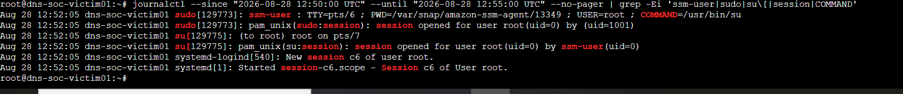

The root shell history then exposed a much stronger context clue.


The history contained:

- `dig` through `10.50.30.10`;
- `curl` to the resolved IP;
- a repeating 20-second loop;
- explicit labels such as `SCENARIO 03 OFFICIAL VICTIM FOLLOW-UP`.

This strongly supported controlled Scenario 03 follow-up activity.

## 👤 11. Attribute only what the timeline supports

CloudTrail showed an SSM `StartSession` at `12:51:53 UTC`.

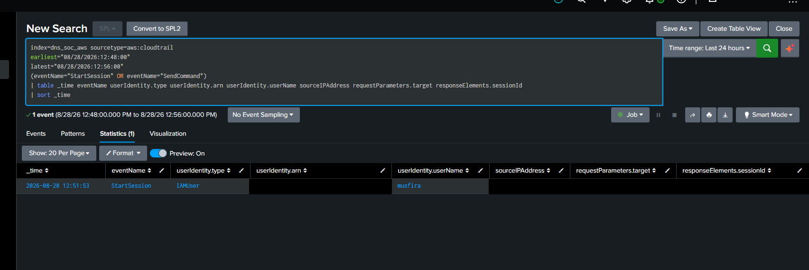

The local root session opened at approximately `12:52:05 UTC`.

But the earliest observed DNS/network activity predated that confirmed session. Bash history also lacked per-command timestamps.

Sonia therefore did **not** claim:

```text
The entire Scenario 03 timeline was generated by that one confirmed SSM session/user.
```

Instead she preserved the honest boundary:

> **Endpoint evidence strongly supports controlled Scenario 03 test activity, while the earliest activity remains individually unattributed from available defender evidence.**

## 🧹 12. Rule out other host explanations

IR checked cron and active process state.

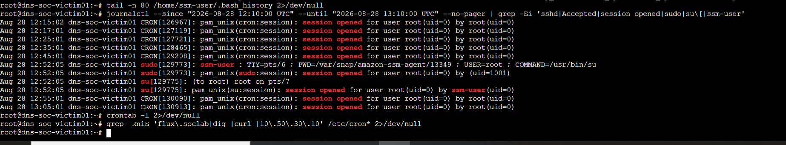

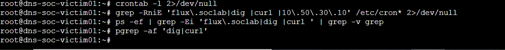

Cron did not explain the scenario behavior, and no matching active process remained when IR made the response decision.

## 🛡️ 13. Response decision — do not contain what no longer needs containment

By this point IR had:

```text
confirmed Fast Flux-like DNS/network behavior
+
strong controlled-test endpoint context
+
one lab victim in scope
+
no current matching DNS/network activity
+
no active matching process
+
no proof of malware / malicious C2 / unauthorized intent
```

Sonia locked:

> ## **CONTROLLED / EXPECTED SCENARIO ACTIVITY — NO CONTAINMENT REQUIRED**

The existing narrow response path remained available:

```text
flux.soclab.abdul4rehman215.tech
→ Unbound RPZ
→ 10.50.30.30 sinkhole
```

It was **not applied**.

No human approval gate was invoked because no enforcing change was proposed.

## 🛡️ ✅ 14. Verify the resolver / RPZ safe state anyway

A no-containment decision still needed a clean closeout.

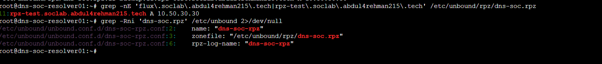

*The active RPZ file contained no Scenario 03 flux rule.*

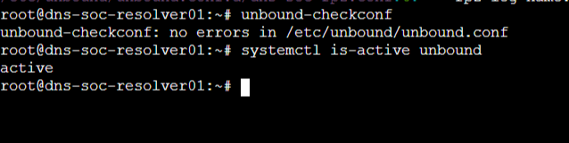

*Configuration validation passed and the resolver service remained active.*

A resolver self-query returned `REFUSED`, which initially looked concerning. IR correctly avoided changing ACLs and repeated the validation from the authorized victim path instead.

## 🌐 15. Final victim-side DNS verification


From `dns-soc-victim01`:

- unrelated DNS resolved successfully through `10.50.30.10`;
- the Scenario 03 domain resolved to a public A record rather than `10.50.30.30`;
- the live response showed TTL `60` at verification time.

The resolver remained in normal operation.

## 🚦 16. Final IR classification

```text
Behavior classification:
Confirmed Fast Flux-like DNS/network behavior

Context classification:
Strongly consistent with controlled Scenario 03 victim-follow-up/test activity

Malicious attribution:
Low / unsupported

Compromise status:
No defender evidence of malware compromise or malicious C2

Response:
NO CONTAINMENT REQUIRED
```

## 🧾 17. Residual limitations

IR intentionally preserved these gaps:

- historical TTL unavailable in the preserved Resolver Query Logs;
- earliest activity cannot be tied to a specific interactive session;
- Bash history had no per-command timestamps;
- Splunk lacked useful process telemetry for the victim;
- hidden operator ground truth was not used to fill defender attribution gaps.

## 💡 18. IR lessons

- Find the real source before writing the search.
- Cloud `query_timestamp` can be more reliable than SIEM display time for event chronology.
- A missing TTL field stays missing; do not turn configuration knowledge into historical evidence.
- If SIEM endpoint telemetry is absent, pivot to legitimate host evidence instead of guessing.
- Evidence can strongly support controlled context without supporting exact user attribution for every event.
- Test a resolver from the actual client trust path before changing DNS ACLs.
- A prepared sinkhole is valuable even when the correct incident response is **not to use it**.

## 🗂️ Reproducibility

- [Formal final report](FINAL-IR-REPORT.md)
- [5W1H](5W1H.md)
- [Timeline](TIMELINE.md)
- [Commands](COMMANDS.md)
- [Troubleshooting / lessons](TROUBLESHOOTING-AND-LESSONS.md)
- [IR SPL](spl/)
- [IR shell validation](shell/)
- [Curated evidence](evidence/)


<div align="center">

[🏠 Scenario Home](../README.md) · [🛡️ Workspace](README.md) · [⬆ Back to top](#top)

**Evidence before attribution. Context before containment.**

</div>


