  

[🏠 Scenario Home](../README.md) · [🔎 SOC Handoff](../soc/SOC-TO-IR-HANDOFF.md) · [🧾 Evidence](evidence/README.md) · [🎭 Final Comparison](../exercise/final-comparison.md)

# 🛡️ Scenario 03 Incident Response Workspace

[Sonia's](https://github.com/sonia11mansha415) job was not to repeat the SOC investigation or activate RPZ because the mechanism existed. IR independently rebuilt the answer history, strengthened network/host context, measured current risk and changed the environment **only if the evidence justified it**.

## 🚦 Response Snapshot

| Field | IR result |
|---|---|
| Responder | [Sonia](https://github.com/sonia11mansha415) |
| Input | evidence-limited SOC handoff |
| Fast Flux-like behavior | independently confirmed |
| Current matching DNS/network activity | inactive at decision time |
| Endpoint/process telemetry in Splunk | insufficient |
| Defender-side host context | strongly consistent with controlled Scenario 03 follow-up |
| Malicious attribution | not established |
| RPZ/sinkhole | available, not activated |
| Resolver | healthy |
| Final classification | **CONTROLLED / EXPECTED SCENARIO ACTIVITY** |
| Final response | **NO CONTAINMENT REQUIRED** |

## ⚖️ Response Decision Path

```mermaid
%%{init: {
  "theme": "base",
  "themeVariables": {
    "background": "#030712",
    "primaryTextColor": "#ffffff",
    "lineColor": "#f8fafc",
    "fontSize": "30px"
  },
  "flowchart": {
    "nodeSpacing": 48,
    "rankSpacing": 58,
    "curve": "basis",
    "padding": 20
  }
}}%%

flowchart LR

    %% =====================================================
    %% 1 · EVIDENCE REVIEW
    %% =====================================================
    subgraph REVIEW[" "]
        direction TB

        H1["🔎 1 · EVIDENCE REVIEW"]

        A["📨 SOC<br/>HANDOFF"]

        B["🔍 INDEPENDENT<br/>DNS HISTORY"]

        C["🌐 NETWORK<br/>CORRELATION"]

        H1 ==> A ==> B ==> C
    end


    %% =====================================================
    %% 2 · RISK DECISION
    %% =====================================================
    subgraph DECISION[" "]
        direction TB

        H2["⚖️ 2 · RISK DECISION"]

        D["⏱️ CURRENT<br/>ACTIVITY CHECK"]

        E["🖥️ ENDPOINT / SESSION<br/>CONTEXT"]

        F["🧭 RISK + ATTRIBUTION<br/>DECISION"]

        G{"⚖️ IS CONTAINMENT<br/>PROPORTIONATE?"}

        H2 ==> D ==> E ==> F ==> G
    end


    %% =====================================================
    %% 3 · SAFE-STATE VERIFICATION
    %% =====================================================
    subgraph VERIFY[" "]
        direction TB

        H3["✅ 3 · SAFE-STATE VERIFICATION"]

        N["🟢 NO CONTAINMENT<br/>REQUIRED"]

        H["🛡️ VERIFY RPZ<br/>SAFE STATE"]

        I["✅ VERIFY RESOLVER<br/>+ VICTIM DNS"]

        H3 ==> N ==> H ==> I
    end


    %% =====================================================
    %% CLEAN LEFT → RIGHT HANDOFFS
    %% =====================================================
    REVIEW ==> DECISION

    G ==> N


    %% =====================================================
    %% PREMIUM GLOSSY HEADERS
    %% =====================================================
    classDef reviewHeader fill:#075985,stroke:#67e8f9,stroke-width:7px,color:#ffffff,font-size:35px,font-weight:bold;

    classDef decisionHeader fill:#78350f,stroke:#fbbf24,stroke-width:7px,color:#ffffff,font-size:35px,font-weight:bold;

    classDef verifyHeader fill:#14532d,stroke:#86efac,stroke-width:7px,color:#ffffff,font-size:35px,font-weight:bold;

    class H1 reviewHeader;
    class H2 decisionHeader;
    class H3 verifyHeader;


    %% =====================================================
    %% EVIDENCE REVIEW COLORS
    %% =====================================================
    classDef handoff fill:#172554,stroke:#60a5fa,stroke-width:6px,color:#ffffff,font-size:30px,font-weight:bold;

    classDef dns fill:#075985,stroke:#22d3ee,stroke-width:6px,color:#ffffff,font-size:30px,font-weight:bold;

    classDef network fill:#164e63,stroke:#38bdf8,stroke-width:6px,color:#ffffff,font-size:30px,font-weight:bold;

    class A handoff;
    class B dns;
    class C network;


    %% =====================================================
    %% DECISION COLORS
    %% =====================================================
    classDef activity fill:#4c1d95,stroke:#c084fc,stroke-width:6px,color:#ffffff,font-size:30px,font-weight:bold;

    classDef endpoint fill:#312e81,stroke:#a78bfa,stroke-width:6px,color:#ffffff,font-size:30px,font-weight:bold;

    classDef risk fill:#9a3412,stroke:#fb923c,stroke-width:6px,color:#ffffff,font-size:30px,font-weight:bold;

    classDef gate fill:#713f12,stroke:#fde047,stroke-width:7px,color:#ffffff,font-size:31px,font-weight:bold;

    class D activity;
    class E endpoint;
    class F risk;
    class G gate;


    %% =====================================================
    %% VERIFICATION COLORS
    %% =====================================================
    classDef noContain fill:#0f766e,stroke:#5eead4,stroke-width:6px,color:#ffffff,font-size:30px,font-weight:bold;

    classDef rpz fill:#166534,stroke:#4ade80,stroke-width:6px,color:#ffffff,font-size:30px,font-weight:bold;

    classDef complete fill:#065f46,stroke:#86efac,stroke-width:7px,color:#ffffff,font-size:31px,font-weight:bold;

    class N noContain;
    class H rpz;
    class I complete;


    %% =====================================================
    %% GLOSSY PANELS
    %% =====================================================
    style REVIEW fill:#051521,stroke:#22d3ee,stroke-width:4px

    style DECISION fill:#180d05,stroke:#fbbf24,stroke-width:4px

    style VERIFY fill:#06150d,stroke:#4ade80,stroke-width:4px


    %% =====================================================
    %% BRIGHT CONNECTORS
    %% =====================================================
    linkStyle default stroke:#f8fafc,stroke-width:6px;
```

## 🖼️ IR Evidence Highlights

<table>
<tr>
<td width="33%"> <b>E03:</b> all three A answers independently recovered.</td>
<td width="33%"> <b>E04:</b> source-native answer chronology.</td>
<td width="33%"> <b>E08:</b> no current matching connections at decision time.</td>
</tr>
<tr>
<td width="33%"> <b>E12:</b> defender-discovered host context.</td>
<td width="33%"> <b>E18:</b> no Scenario 03 enforcing RPZ rule.</td>
<td width="33%"> <b>E20:</b> normal resolver operation verified from the authorized client path.</td>
</tr>
</table>

## 🗂️ Start Here

- [`INCIDENT-RESPONSE.md`](INCIDENT-RESPONSE.md) — flagship IR story
- [`FINAL-IR-REPORT.md`](FINAL-IR-REPORT.md) — formal closeout
- [`5W1H.md`](5W1H.md) — structured IR record
- [`TIMELINE.md`](TIMELINE.md) — defender timeline
- [`COMMANDS.md`](COMMANDS.md) — evidence-collection ledger
- [`TROUBLESHOOTING-AND-LESSONS.md`](TROUBLESHOOTING-AND-LESSONS.md) — curated lessons
- [`spl/README.md`](spl/README.md) — IR search lifecycle
- [`shell/README.md`](shell/README.md) — read-only host-validation path
- [`evidence/README.md`](evidence/README.md) — curated IR evidence

> **Response mechanism ≠ response requirement.** The correct outcome was to leave the resolver unchanged and prove the safe state.

[🏠 Scenario Home](../README.md) · [📖 IR Story](INCIDENT-RESPONSE.md) · [📋 Final Report](FINAL-IR-REPORT.md) · [🧾 Evidence](evidence/README.md)

 

**Strengthen the evidence. Measure current risk. Change only what the evidence justifies.**

[⬆ Back to top](#top)

