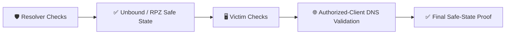

[🏠 Scenario Home](../../README.md) · [🛡️ IR Workspace](../README.md) · [📖 IR Story](../INCIDENT-RESPONSE.md)

# 💻 Scenario 03 IR — Read-Only Host Validation

These scripts support **defender-side validation**, not scenario generation.

| Script | Purpose |
|---|---|
| [`resolver-readonly-validation.sh`](resolver-readonly-validation.sh) | inspect resolver configuration/service/RPZ state without applying Scenario 03 containment |
| [`victim-readonly-checks.sh`](victim-readonly-checks.sh) | validate victim-side state and normal DNS behavior |

> **Important:** historical commands discovered in shell history are evidence. They are not represented here as commands IR re-ran to generate scenario behavior.

[🛡️ IR Workspace](../README.md) · [💻 Command Ledger](../COMMANDS.md) · [🧾 Evidence](../evidence/README.md)

 

**Read-only validation protects the evidence boundary while proving the safe state.**

[⬆ Back to top](#top)

