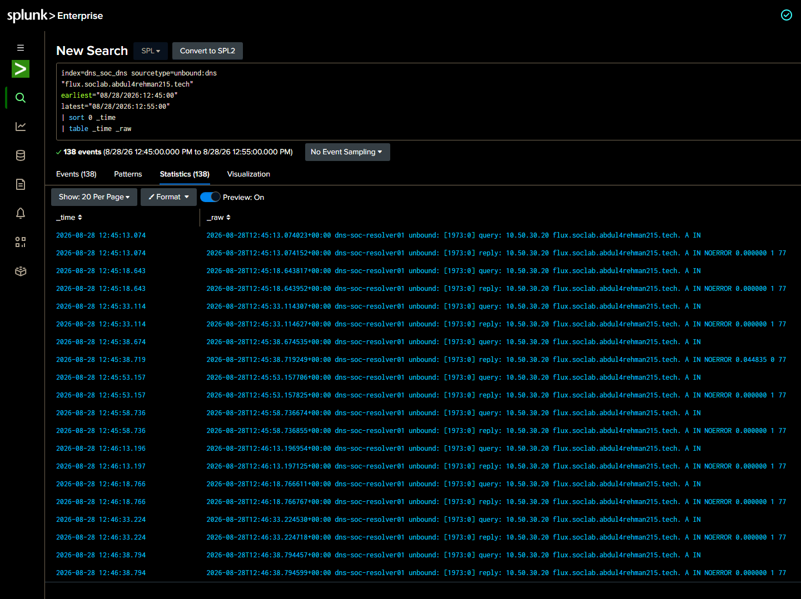
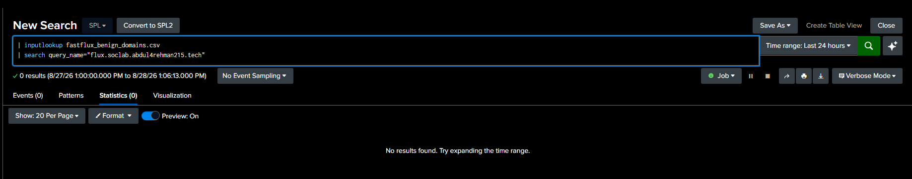
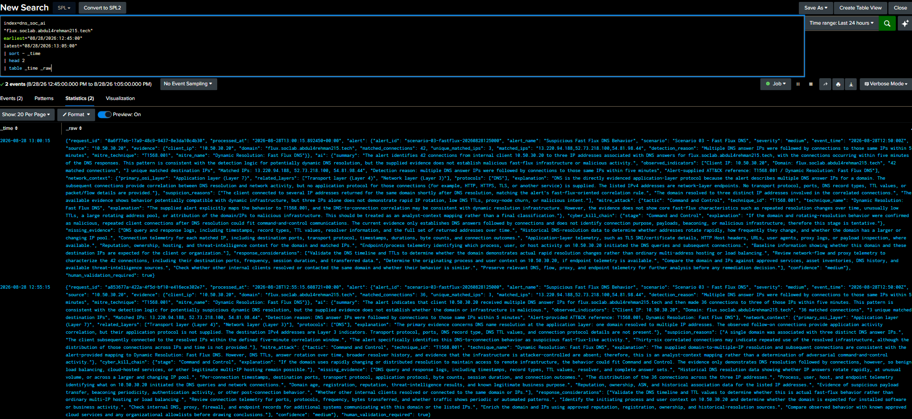

  

[🏠 Scenario Home](../README.md) · [🧠 Detection](../detection-engineering/README.md) · [🧾 Evidence](evidence/README.md) · [🛡️ IR](../ir/README.md)

# 🔎 Scenario 03 SOC Workspace

Abdul-Rehman investigated the live Fast Flux alert **without operator ground truth**. The job was to validate behavior, scope it, challenge false-positive explanations and AI claims, then escalate only the unanswered questions that required stronger defender evidence.

## 🚦 Case Snapshot

| Field | SOC result |
|---|---|
| Analyst | [Abdul-Rehman](https://github.com/abdul4rehman215) |
| Client | `10.50.30.20` |
| Scenario A-query events | **274** |
| Alert-associated public IPs | **3** |
| Manual VPC Flow validation | **37** flows in the narrow window |
| Per-IP manual counts | `14 / 15 / 8` |
| Later detection-side count | **42** for the same 12:50 bucket |
| Benign lookup | scenario domain not present |
| AI grade | **Partially Correct** |
| Fast Flux-like behavior confidence | **Medium-High** |
| Malicious attribution confidence | **Low** |
| Final disposition | **INCONCLUSIVE — ESCALATION WARRANTED** |

> The 37-versus-42 difference is preserved. Manual investigation and the production search used different aggregation/window logic.

## 🔁 Investigation Path

```mermaid
%%{init: {
  "theme": "base",
  "themeVariables": {
    "background": "#030712",
    "primaryTextColor": "#ffffff",
    "lineColor": "#f8fafc",
    "fontSize": "30px"
  },
  "flowchart": {
    "nodeSpacing": 50,
    "rankSpacing": 60,
    "curve": "basis",
    "padding": 22
  }
}}%%

flowchart LR

    %% =====================================================
    %% 1 · EVIDENCE INTAKE
    %% =====================================================
    subgraph EVIDENCE[" "]
        direction TB

        H1["🚨 1 · EVIDENCE INTAKE"]

        A["🚨 LIVE ALERT<br/>Detection Trigger"]

        B["📡 RAW DNS<br/>Resolver Evidence"]

        C["🌐 VPC FLOW<br/>Network Evidence"]

        H1 ==> A ==> B ==> C
    end


    %% =====================================================
    %% 2 · BEHAVIOR ANALYSIS
    %% =====================================================
    subgraph ANALYSIS[" "]
        direction TB

        H2["🔎 2 · BEHAVIOR ANALYSIS"]

        D["🧹 BENIGN LOOKUP<br/>Known-Safe Comparison"]

        E["🎯 CLIENT SCOPE<br/>Affected Host / Source"]

        F["📊 BASELINE<br/>Normal vs Current"]

        H2 ==> D ==> E ==> F
    end


    %% =====================================================
    %% 3 · DECISION + HANDOFF
    %% =====================================================
    subgraph DECISION[" "]
        direction TB

        H3["🛡️ 3 · DECISION + HANDOFF"]

        G["🤖 AI CHALLENGE<br/>Question the Evidence"]

        H["🧭 5W1H<br/>Who · What · When<br/>Where · Why · How"]

        I["📨 IR HANDOFF<br/>Evidence-Backed Escalation"]

        H3 ==> G ==> H ==> I
    end


    %% =====================================================
    %% KEEP THE THREE COLUMNS PARALLEL
    %% =====================================================
    EVIDENCE ==> ANALYSIS
    ANALYSIS ==> DECISION


    %% =====================================================
    %% PREMIUM NEON HEADERS
    %% =====================================================
    classDef evidenceHeader fill:#7f1d1d,stroke:#fb7185,stroke-width:7px,color:#ffffff,font-size:35px,font-weight:bold;

    classDef analysisHeader fill:#075985,stroke:#67e8f9,stroke-width:7px,color:#ffffff,font-size:35px,font-weight:bold;

    classDef decisionHeader fill:#4c1d95,stroke:#e879f9,stroke-width:7px,color:#ffffff,font-size:35px,font-weight:bold;

    class H1 evidenceHeader;
    class H2 analysisHeader;
    class H3 decisionHeader;


    %% =====================================================
    %% EVIDENCE COLORS
    %% =====================================================
    classDef alert fill:#991b1b,stroke:#fb7185,stroke-width:6px,color:#ffffff,font-size:30px,font-weight:bold;

    classDef dns fill:#0c4a6e,stroke:#22d3ee,stroke-width:6px,color:#ffffff,font-size:30px,font-weight:bold;

    classDef flow fill:#172554,stroke:#60a5fa,stroke-width:6px,color:#ffffff,font-size:30px,font-weight:bold;

    class A alert;
    class B dns;
    class C flow;


    %% =====================================================
    %% ANALYSIS COLORS
    %% =====================================================
    classDef benign fill:#14532d,stroke:#4ade80,stroke-width:6px,color:#ffffff,font-size:30px,font-weight:bold;

    classDef scope fill:#713f12,stroke:#fbbf24,stroke-width:6px,color:#ffffff,font-size:30px,font-weight:bold;

    classDef baseline fill:#312e81,stroke:#a78bfa,stroke-width:6px,color:#ffffff,font-size:30px,font-weight:bold;

    class D benign;
    class E scope;
    class F baseline;


    %% =====================================================
    %% DECISION COLORS
    %% =====================================================
    classDef ai fill:#581c87,stroke:#f0abfc,stroke-width:6px,color:#ffffff,font-size:30px,font-weight:bold;

    classDef fivew fill:#9a3412,stroke:#fb923c,stroke-width:6px,color:#ffffff,font-size:30px,font-weight:bold;

    classDef handoff fill:#065f46,stroke:#86efac,stroke-width:7px,color:#ffffff,font-size:31px,font-weight:bold;

    class G ai;
    class H fivew;
    class I handoff;


    %% =====================================================
    %% GLOSSY PANELS
    %% =====================================================
    style EVIDENCE fill:#17080c,stroke:#fb7185,stroke-width:4px

    style ANALYSIS fill:#051521,stroke:#22d3ee,stroke-width:4px

    style DECISION fill:#150821,stroke:#d946ef,stroke-width:4px


    %% =====================================================
    %% BRIGHT CONNECTORS
    %% =====================================================
    linkStyle default stroke:#f8fafc,stroke-width:6px;
```

## 🖼️ SOC Evidence Highlights

<table>
<tr>
<td width="33%"> <b>E03:</b> production Fast Flux lead.</td>
<td width="33%"> <b>E04:</b> raw defender DNS evidence.</td>
<td width="33%"> <b>E08:</b> network follow-up to all three alert destinations.</td>
</tr>
<tr>
<td width="33%"> <b>E10:</b> scenario domain absent from tuning allowlist.</td>
<td width="33%"> <b>E14:</b> scenario-domain deviation from normal client DNS activity.</td>
<td width="33%"> <b>E18:</b> AI output inspected as evidence, not verdict.</td>
</tr>
</table>

## 🗂️ Start Here

- [`SOC-ANALYST-INVESTIGATION.md`](SOC-ANALYST-INVESTIGATION.md) — flagship investigation
- [`5W1H.md`](5W1H.md) — structured case record
- [`AI-VALIDATION.md`](AI-VALIDATION.md) — human review of AI output
- [`SOC-TO-IR-HANDOFF.md`](SOC-TO-IR-HANDOFF.md) — evidence-limited handoff
- [`SPL-QUERY-INDEX.md`](SPL-QUERY-INDEX.md) — executed investigation search map
- [`TROUBLESHOOTING-NOTES.md`](TROUBLESHOOTING-NOTES.md) — investigation lessons
- [`spl/README.md`](spl/README.md) — visual query lifecycle
- [`evidence/README.md`](evidence/README.md) — E01–E18 evidence portal

> **SOC success here was restraint:** confirm the Fast Flux-like behavior, preserve attribution limits, and escalate the questions the available evidence could not answer.

[🏠 Scenario Home](../README.md) · [📖 Full Investigation](SOC-ANALYST-INVESTIGATION.md) · [📨 IR Handoff](SOC-TO-IR-HANDOFF.md) · [🧾 Evidence](evidence/README.md)

 

**Validate the behavior. Preserve the limits. Escalate the unanswered questions.**

[⬆ Back to top](#top)

