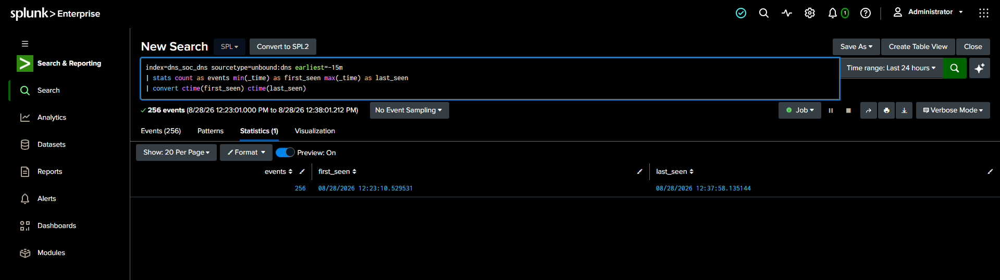
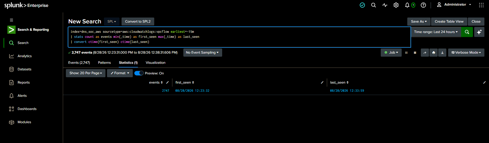
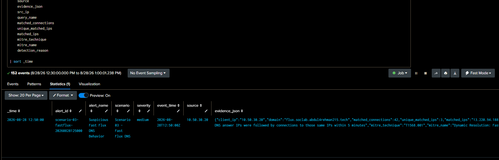
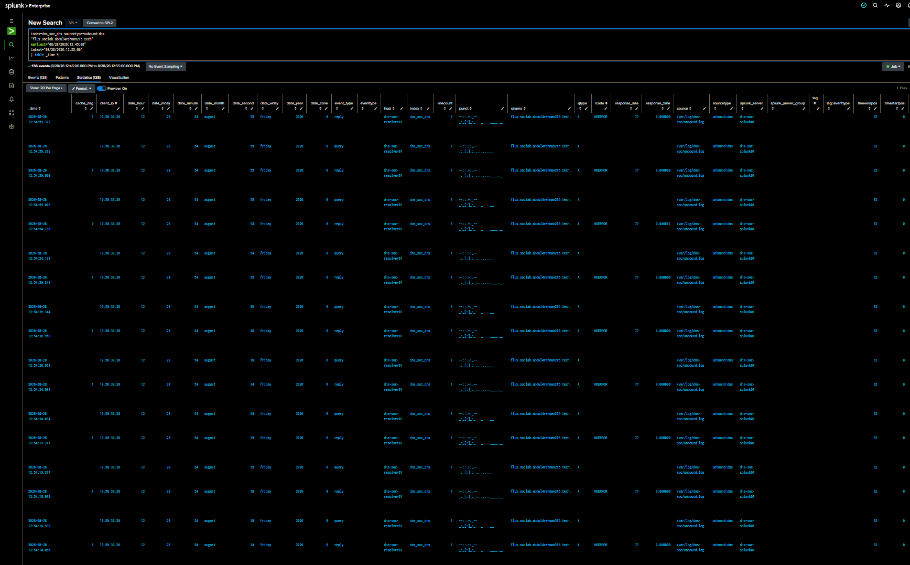
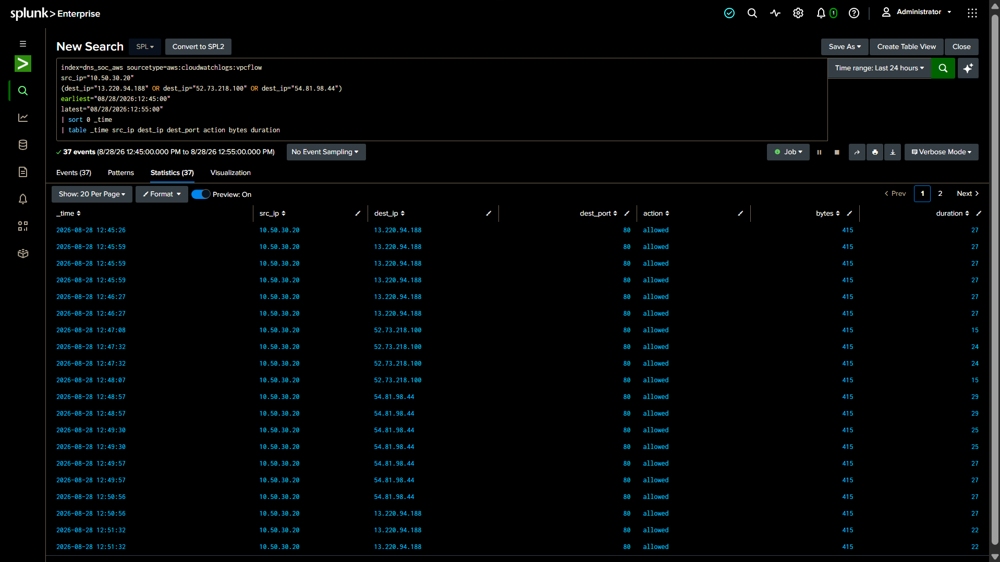
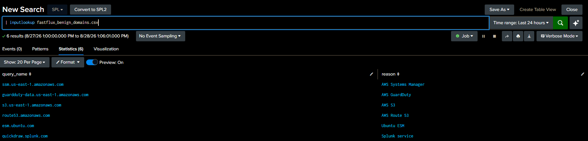
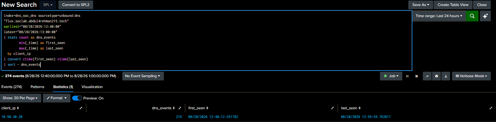
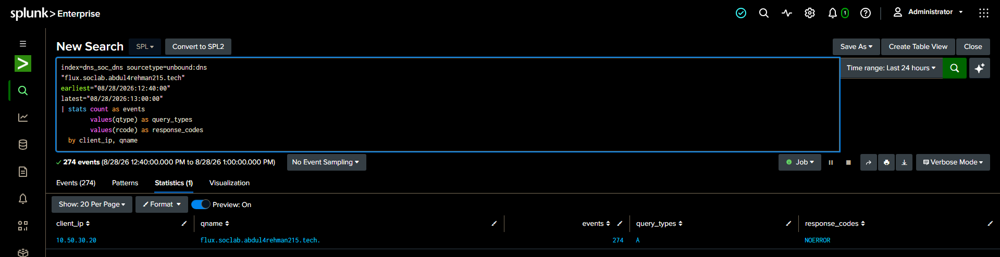
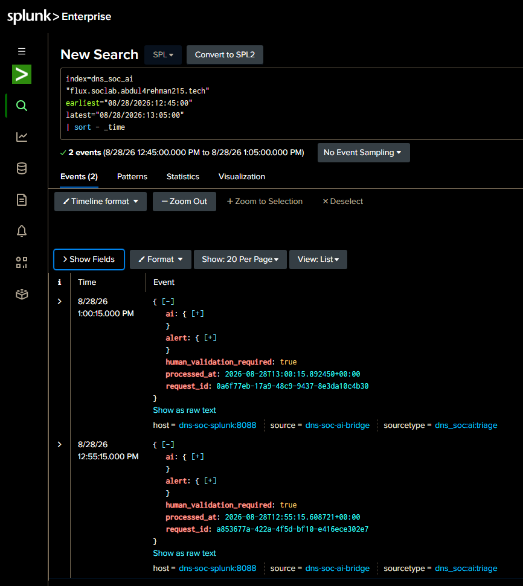
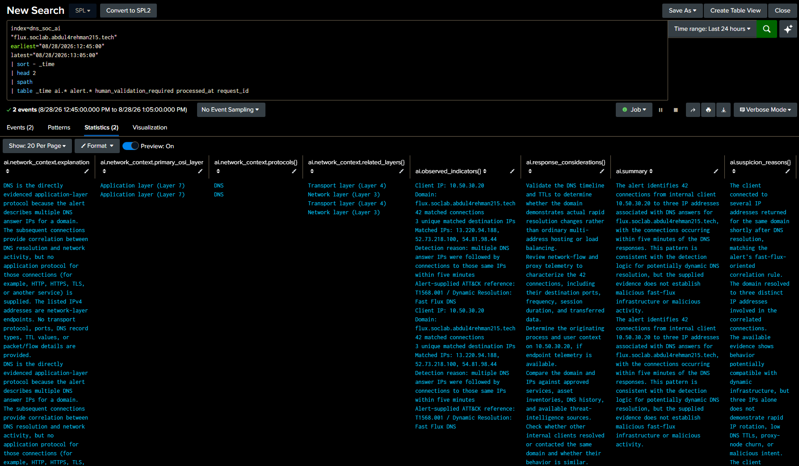

<a id="top"></a>


<div align="center">

  

[🏠 Scenario Home](../README.md) · [🔎 Workspace](README.md) · [🧾 Evidence](../evidence/README.md)

</div>


# 🔎 SOC Analyst Investigation — Scenario 03 Fast Flux DNS

**SOC Analyst / Threat Hunter:** [Abdul-Rehman](https://github.com/abdul4rehman215)  
**Scenario:** Fast Flux DNS  
**MITRE:** `T1568.001 — Dynamic Resolution: Fast Flux DNS`  
**Final SOC disposition:** **INCONCLUSIVE — ESCALATION WARRANTED**

The investigation began with one rule: **the alert is a lead, not the answer**.

Abdul-Rehman did not know Lubaba's exact controller time, transition order or operator ground truth. He had to rebuild the case from the same defender-visible evidence a SOC analyst would actually receive: Unbound, VPC Flow Logs, the frozen alert, the benign lookup, baseline activity and the AI summary.

## 🧭 1. Investigation question

The analyst was not trying to prove malware. He was trying to answer:

> **Did the defender-visible evidence show abnormal Fast Flux-like DNS/network behavior, and if so, what could the SOC responsibly conclude?**

## 🟢 2. Prove telemetry health first

Before accepting a quiet or noisy screen, Abdul confirmed the two primary evidence pipelines were alive.



*Unbound telemetry was current enough to support live investigation.*



*VPC Flow Logs were also active, preventing a missing-data condition from being mistaken for clean behavior.*

This is a small step with a large consequence: **data health belongs inside the investigation, not outside it.**

## 🚨 3. Preserve the live alert before interpreting it

The production alert surfaced the Scenario 03 domain and victim.


The initial live lead included:

```text
client: 10.50.30.20
domain: flux.soclab.abdul4rehman215.tech
unique matched IPs: 3
matched connections: 36
severity: Medium
MITRE: T1568.001
```

A later trigger for the same `12:50` event bucket displayed 42 matched connections.



Abdul did **not** call this a second incident. The same event identity and entities showed it was a repeated evaluation/update of the same detection bucket.

## 🌐 4. Validate the DNS activity independently

Raw Unbound evidence confirmed repeated A queries for the scenario domain from `10.50.30.20` with `NOERROR` responses.


The expanded field view exposed `client_ip`, `qname`, `qtype` and `rcode`.



But the displayed Unbound events did **not** expose the returned IPv4 answer values.

That became a formal investigation limit:

> **The SOC could independently prove repeated successful A-query behavior, but it could not independently reconstruct the three answer IPs from the displayed Unbound fields.**

The analyst did not invent an answer field or silently inherit the detection's claim as raw-log proof.

## 🔗 5. Independently prove the network side

The alert named:

```text
13.220.94.188
52.73.218.100
54.81.98.44
```

VPC Flow Logs independently confirmed the victim contacted all three over TCP/80 with action `allowed`.




| Destination | Manual flow events | First seen UTC | Last seen UTC | Port | Action |
|---|---:|---|---|---:|---|
| `13.220.94.188` | 14 | 12:45:26 | 12:52:57 | 80 | allowed |
| `52.73.218.100` | 15 | 12:47:08 | 12:54:27 | 80 | allowed |
| `54.81.98.44` | 8 | 12:48:57 | 12:54:56 | 80 | allowed |

The manual narrow-window total was **37** flows. The production detection later reported **42** matched connections.

Rather than altering the manual search until the numbers matched, Abdul preserved both counts and documented the likely window/aggregation difference.

## 🧪 6. Ask whether the rule's benign tuning explains it

The final Detection Engineering rule already contained a benign dynamic-domain lookup.



The scenario domain returned zero lookup matches.


The correct interpretation was:

```text
not in known-benign lookup ≠ malicious
```

It only meant the configured tuning did not explain the behavior as one of the known dynamic services.

## 🎯 7. Scope the affected client

The reviewed 12:40–13:00 UTC scope showed one internal client.





```text
client: 10.50.30.20
A-query events: 274
response: NOERROR
other internal clients querying same domain: none observed
```

Process and user remained unknown at the SOC stage.

## 📊 8. Compare with the client's own baseline

The scenario domain generated **274** A-query events in the reviewed 20-minute window.


The next-highest comparison domains were much lower:

```text
GuardDuty-related: 20
SSM-related:       14
AWS DNS name:      12
internal victim:   10
```

A statistical deviation view supported the same story but was treated as secondary because the large outlier influenced the small sample's average and standard deviation.


The ranked raw counts were therefore the stronger explanation.

## 🧠 9. Form the human hypothesis before opening AI

Before reviewing `dns_soc_ai`, Abdul could already state:

> `10.50.30.20` showed sustained, abnormal DNS activity for `flux.soclab.abdul4rehman215.tech`. The domain generated 274 A-query events, far exceeding other observed domains for the same client. The production detection associated the domain with three public IPs, and independent VPC Flow evidence confirmed allowed HTTP connections to all three. The domain was not present in the configured benign lookup. The behavior is consistent with Fast Flux-like activity, but available evidence does not prove malware, compromise, C2 ownership or unauthorized intent.

Only then did AI enter the reasoning chain.

## 🤖 10. Validate AI as evidence, not authority

Two AI triage events were present and correctly carried `human_validation_required=true`.



The expanded AI fields showed conservative reasoning, MITRE context, missing-evidence notes and response considerations.




The final grade was:

> **AI Validation: PARTIALLY CORRECT**

It correctly preserved uncertainty and avoided a malware/C2 verdict, but parts of its DNS-to-IP reasoning depended on the production alert before the analyst had independently rebuilt all supporting evidence. It also did not initially contain Abdul's later baseline, scope and manual VPC Flow findings.

See [`AI-VALIDATION.md`](AI-VALIDATION.md).

## 🧾 11. Complete 5W1H

The final 5W1H record is preserved in [`5W1H.md`](5W1H.md).

The important attribution boundary remained:

```text
WHO: resolver-visible client known; responsible user/process unknown
WHAT: repeated A queries + network follow-up to three public IPs
WHEN: 12:40:12–12:59:59 UTC reviewed window
WHERE: defender resolver + TCP/80 public destinations
WHY: major baseline deviation + matched destinations + no benign lookup explanation
HOW: repeated DNS resolution followed by allowed HTTP connections
```

## 🚦 12. Final SOC disposition

The evidence was strong enough to confirm abnormal Fast Flux-like behavior, but not strong enough to assign malicious intent or compromise.

Abdul-Rehman therefore locked:

> ## **INCONCLUSIVE — ESCALATION WARRANTED**

**Confidence:**

- Fast Flux-like DNS/network behavior: **Medium-High**
- Malicious attribution: **Low**

The SOC explicitly did **not** establish:

- malware presence;
- compromised endpoint;
- responsible process;
- responsible user;
- attacker ownership of the IPs;
- malicious domain ownership;
- confirmed malicious C2;
- unauthorized intent;
- independently visible historical TTL from the displayed Unbound events.

## 🛡️ 13. Handoff to IR

The final defender-only handoff is preserved in [`SOC-TO-IR-HANDOFF.md`](SOC-TO-IR-HANDOFF.md).

Sonia was asked to independently answer the questions the SOC could not:

- can stronger DNS evidence recover the actual answer history?
- what process/user context exists on the victim?
- are the destinations expected?
- is activity still active?
- is containment justified?

## 💡 14. SOC lessons

- An older alert can be a distraction; case identity comes from time + entity + domain.
- Raw DNS can prove activity while still lacking the answer field needed for stronger attribution.
- A repeated alert is not automatically a second incident.
- Valid manual and detection counts can differ because the windows/aggregations differ.
- “Not in allowlist” is context, not guilt.
- A simple statistic can be less useful than a clear ranked baseline.
- AI should be opened after the analyst can already explain the evidence.
- **INCONCLUSIVE** is a strong result when it precisely identifies what needs the next investigative authority.

## 🗂️ Reproducibility

- [SOC SPL query index](SPL-QUERY-INDEX.md)
- [Executed SOC SPL](spl/)
- [SOC evidence](evidence/)
- [AI validation](AI-VALIDATION.md)
- [5W1H](5W1H.md)
- [SOC → IR handoff](SOC-TO-IR-HANDOFF.md)
- [Troubleshooting / learning journey](TROUBLESHOOTING-NOTES.md)


<div align="center">

[🏠 Scenario Home](../README.md) · [🔎 Workspace](README.md) · [⬆ Back to top](#top)

**Evidence before attribution. Context before containment.**

</div>


