[🏠 Scenario Home](../../README.md) · [🔎 SOC Workspace](../README.md) · [📘 Query Index](../SPL-QUERY-INDEX.md)

# 🔎 Scenario 03 SOC — Query Lifecycle

These searches preserve the analyst's actual progression from data readiness to evidence-limited escalation.

```mermaid
flowchart LR
    A["🩺 DNS Readiness"] --> B["🌐 VPC Flow Readiness"]
    B --> C["🚨 Existing / Live Alert"]
    C --> D["📡 Raw DNS"]
    D --> E["🌐 Flow Correlation"]
    E --> F["🧹 Benign Lookup"]
    F --> G["🎯 Scope"]
    G --> H["📊 Baseline"]
    H --> I["🤖 AI Validation"]
    I --> J["📨 IR Handoff"]
```

| Stage | Search |
|---|---|
| DNS telemetry readiness | [`01-monitoring-readiness-dns.spl`](01-monitoring-readiness-dns.spl) |
| VPC Flow readiness | [`02-monitoring-readiness-vpc.spl`](02-monitoring-readiness-vpc.spl) |
| pre-existing alert raw DNS | [`03-preexisting-alert-raw-dns.spl`](03-preexisting-alert-raw-dns.spl) |
| live-domain raw DNS | [`04-live-domain-raw-dns.spl`](04-live-domain-raw-dns.spl) |
| expanded DNS fields | [`05-live-domain-expanded-fields.spl`](05-live-domain-expanded-fields.spl) |
| raw three-IP flows | [`06-vpc-flow-raw-three-ips.spl`](06-vpc-flow-raw-three-ips.spl) |
| summarized three-IP flows | [`07-vpc-flow-summary-three-ips.spl`](07-vpc-flow-summary-three-ips.spl) |
| benign lookup contents | [`08-benign-lookup-contents.spl`](08-benign-lookup-contents.spl) |
| benign lookup no-match | [`09-benign-lookup-no-match.spl`](09-benign-lookup-no-match.spl) |
| one-client scope | [`10-scope-single-client.spl`](10-scope-single-client.spl) |
| query type / response scope | [`11-scope-query-type-response.spl`](11-scope-query-type-response.spl) |
| baseline top A domains | [`12-baseline-top-a-domains.spl`](12-baseline-top-a-domains.spl) |
| baseline deviation | [`13-baseline-deviation.spl`](13-baseline-deviation.spl) |
| AI search | [`14-ai-search.spl`](14-ai-search.spl) |
| AI expanded fields | [`15-ai-expanded-fields.spl`](15-ai-expanded-fields.spl) |
| AI raw output | [`16-ai-raw.spl`](16-ai-raw.spl) |

[`ALL-SOC-INVESTIGATION-QUERIES.spl`](ALL-SOC-INVESTIGATION-QUERIES.spl) preserves the complete executed query set in one file.

[🔎 SOC Workspace](../README.md) · [📘 Query Index](../SPL-QUERY-INDEX.md) · [🧾 Evidence](../evidence/README.md)

 

**Searches are preserved in the order the analyst needed the questions answered.**

[⬆ Back to top](#top)

