<a id="top"></a>


<div align="center">


 

[🏠 Scenario Home](../README.md) · [🧠 Detection Engineering](../detection-engineering/README.md) · [📊 Dashboard](../dashboard/README.md)

</div>


# 🔎 Scenario 03 — SPL Workspace

This workspace separates the **clean production path** from intermediate engineering hypotheses retained for provenance.

## 🧭 Canonical Production Path

```mermaid
%%{init: {
  "theme": "base",
  "themeVariables": {
    "background": "#030712",
    "primaryTextColor": "#ffffff",
    "lineColor": "#f8fafc",
    "fontSize": "31px"
  },
  "flowchart": {
    "nodeSpacing": 58,
    "rankSpacing": 72,
    "curve": "basis",
    "padding": 22
  }
}}%%

flowchart LR

    %% =====================================================
    %% DETECTION ENGINEERING FILE FLOW
    %% =====================================================
    A["📊 baseline.spl"]

    B["🔎 hunting.spl"]

    C["🧠 detection.spl<br/>v1.0"]

    D["✅ validation.spl"]

    E["🚨 scheduled-alert.md"]

    F["🧹 fastflux_benign_domains.csv"]


    %% =====================================================
    %% MAIN FLOW
    %% =====================================================
    A ==> B ==> C ==> D ==> E

    %% TUNING / BENIGN LOOKUP BRANCH
    C ==> F


    %% =====================================================
    %% PREMIUM GLOSSY NODE STYLES
    %% =====================================================

    %% Baseline
    classDef baseline fill:#172554,stroke:#60a5fa,stroke-width:6px,color:#ffffff,font-size:31px,font-weight:bold;

    %% Hunting
    classDef hunting fill:#075985,stroke:#22d3ee,stroke-width:6px,color:#ffffff,font-size:31px,font-weight:bold;

    %% Detection — visual centerpiece
    classDef detection fill:#4c1d95,stroke:#e879f9,stroke-width:7px,color:#ffffff,font-size:33px,font-weight:bold;

    %% Validation
    classDef validation fill:#14532d,stroke:#4ade80,stroke-width:6px,color:#ffffff,font-size:31px,font-weight:bold;

    %% Scheduled alert
    classDef alert fill:#7f1d1d,stroke:#fb7185,stroke-width:7px,color:#ffffff,font-size:31px,font-weight:bold;

    %% Benign tuning list
    classDef tuning fill:#78350f,stroke:#fbbf24,stroke-width:6px,color:#ffffff,font-size:30px,font-weight:bold;


    %% =====================================================
    %% APPLY COLORS
    %% =====================================================
    class A baseline;
    class B hunting;
    class C detection;
    class D validation;
    class E alert;
    class F tuning;


    %% =====================================================
    %% PREMIUM CONNECTORS
    %% =====================================================
    linkStyle 0 stroke:#60a5fa,stroke-width:6px;
    linkStyle 1 stroke:#c084fc,stroke-width:6px;
    linkStyle 2 stroke:#4ade80,stroke-width:6px;
    linkStyle 3 stroke:#fb7185,stroke-width:6px;
    linkStyle 4 stroke:#fbbf24,stroke-width:6px;
```



| File | Purpose |
|---|---|
| [`baseline.spl`](baseline.spl) | victim network + DNS baseline |
| [`hunting.spl`](hunting.spl) | public destination churn + Resolver answer churn hunts |
| [`detection.spl`](detection.spl) | frozen Detection v1.0 |
| [`validation.spl`](validation.spl) | reusable tuning/final-output validation |
| [`fastflux_benign_domains.csv`](fastflux_benign_domains.csv) | observed benign dynamic-domain tuning lookup |
| [`scheduled-alert.md`](scheduled-alert.md) | production alert settings |
| [`engineering-validation/`](engineering-validation/) | rejected/intermediate hypotheses preserved for provenance |

## 🧠 Final Behavioral Boundary

```text
same DNS domain
+
2+ public returned answer IPs
+
victim connections to those same answer IPs
+
3+ matched connections
+
5-minute bucket
+
known benign dynamic domains removed
```

> **Why this matters:** the rule does not equate “multiple answers” with Fast Flux. It requires DNS/network correlation and retains benign-dynamic context.


<div align="center">

[🏠 Scenario Home](../README.md) · [🧠 Detection Workspace](../detection-engineering/README.md) · [📊 Dashboard](../dashboard/README.md)

<br/>

**Readable SPL is part of the evidence chain.**

[⬆ Back to top](#top)

</div>


